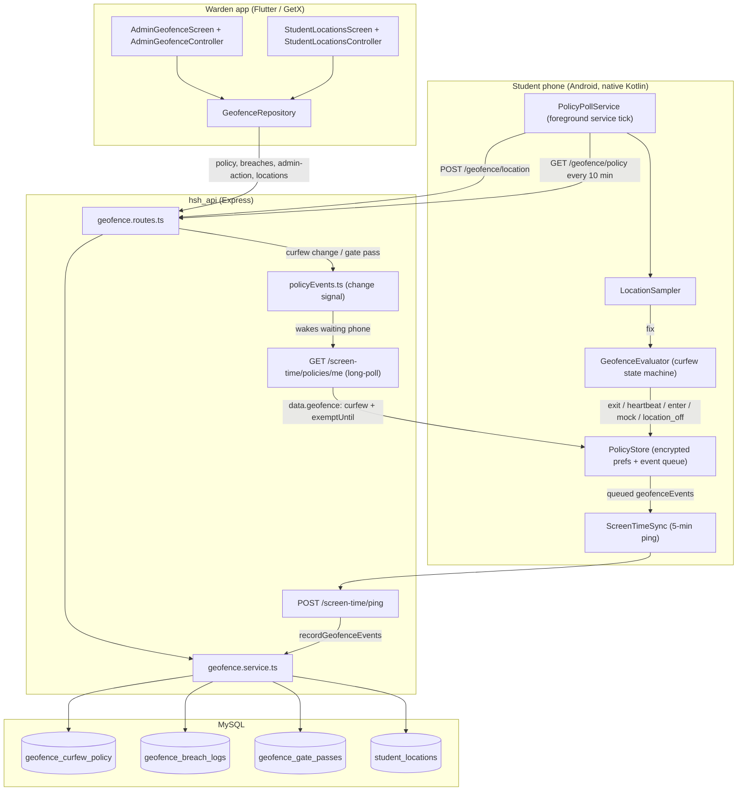

# Campus Geofence, Curfew Monitoring & Student Locations

> **Last updated:** 2026-10-06 · **Repos:** `hsh_app2` (Flutter + native Android) and `hsh_api` (Node/Express/MySQL)
>
> Paths starting with `lib/` or `android/` are in this repo; paths starting with `hsh_api/` are in the backend repo.

---

## 1. What this feature does

| Capability | Summary |
| :--- | :--- |
| **Curfew monitoring** | During the configured curfew window, every student phone checks whether it is inside the hostel boundary and reports breaches to the backend. |
| **Breach console** | Wardens see active breaches and can call the student, call a parent, push a curfew warning, or grant a temporary gate pass. |
| **Student Locations** | Every student's last reported location, all day (not only during curfew), with inside/outside status and an "Open in Maps" link. |
| **Location update interval** | Wardens choose how often phones report (1, 2, 5 or 10 minutes; default 2) from the Campus Geofence screen. |

**The geofence never locks phones.** It only observes and reports. Phone locking exists only in Screen Time (see [PARENT_CONTROL_DOCS.md](PARENT_CONTROL_DOCS.md)). The old "auto-lock when outside" option and the "Lock Phone" breach action were removed on 2026-10-05.

**Platforms:** student-side monitoring runs on **Android only** (`GeofenceDeviceService.isSupported => Platform.isAndroid`). The warden screens work on any platform the app runs on.

---

## 2. Architecture

---

## 3. File map

### Flutter (`lib/`)

| File | Role |
| :--- | :--- |
| [geofence_policy_model.dart](../lib/core/models/geofence/geofence_policy_model.dart) | Curfew policy: `startTime`, `endTime`, `isActive`, `checkIntervalMinutes` (location interval), `repeatDays`, `exemptUntil`. `isWithinCurfew()` handles overnight windows. |
| [geofence_breach_event.dart](../lib/core/models/geofence/geofence_breach_event.dart) | Breach record. Event types `exit`, `heartbeat`, `enter`, `mockLocation`, `locationOff`; actions `BreachActionStatus`. Distance badge shows "Back on campus", "Location turned off" and "Fake GPS detected". |
| [student_location.dart](../lib/core/models/geofence/student_location.dart) | `StudentLocation` + `LocationFix` (lat/lng, accuracy, mocked, insideCampus, distance, fixTime) and `LocationStatus` (outside / inside / unknownArea / noData). |
| [geofence_repository.dart](../lib/core/network/repository/geofence/geofence_repository.dart) | HTTP calls: policy, breaches, admin actions, student locations. All methods throw on failure. |
| [geofence_service.dart](../lib/core/services/geofence_service.dart) | Dart copy of the campus polygon and point-in-polygon maths (used by the warden UI). |
| [geofence_device_service.dart](../lib/core/services/geofence_device_service.dart) | Student-side bridge to the `hsh/geofence` MethodChannel: permission level, status snapshot, sample-now; two-step "Allow all the time" request. |
| [admin_geofence_controller.dart](../lib/features/geofence/controllers/admin_geofence_controller.dart) / [admin_geofence_screen.dart](../lib/features/geofence/views/admin_geofence_screen.dart) | Campus Geofence screen: curfew schedule, location interval, breach cards and actions. Route `Routes.operatorGeofence`. |
| [student_locations_controller.dart](../lib/features/geofence/controllers/student_locations_controller.dart) / [student_locations_screen.dart](../lib/features/geofence/views/student_locations_screen.dart) | Student Locations list. Route `Routes.operatorStudentLocations`. |
| [device_setup_screen.dart](../lib/features/screentime/views/device_setup_screen.dart) | Student onboarding; step 3 requests location "Allow all the time" and discloses that location is collected every few minutes, all day, even with the app closed, and shown to hostel staff (the in-app disclosure Google Play requires before the permission prompt). |
| [home_controller.dart](../lib/features/home/controllers/home_controller.dart) | Sends a student back to setup if location "always" (or another required permission) is revoked. |

### Native Android (`android/app/src/main/kotlin/com/example/hsh_app2/screentime/`)

| File | Role |
| :--- | :--- |
| [GeofenceEvaluator.kt](../android/app/src/main/kotlin/com/example/hsh_app2/screentime/GeofenceEvaluator.kt) | Campus polygon, curfew window, point-in-polygon, distance to fence edge, the inside/outside state machine, location-unavailable reporting, stale-state reset. |
| [LocationSampler.kt](../android/app/src/main/kotlin/com/example/hsh_app2/screentime/LocationSampler.kt) | One fresh, trustworthy fix (or null): permission level, location switch, cached-fix reuse, provider choice, timeout, mock detection. |
| [PolicyPollService.kt](../android/app/src/main/kotlin/com/example/hsh_app2/screentime/PolicyPollService.kt) | Foreground service. Its tick drives curfew sampling, all-day location sampling, location upload and the 10-minute geofence policy refresh; its sync loop long-polls the policy (which also carries the geofence policy). |
| [PolicyStore.kt](../android/app/src/main/kotlin/com/example/hsh_app2/screentime/PolicyStore.kt) | Encrypted storage: geofence policy, state, streak, last fix, event queue (max 300), throttle timestamps, last reported fix. `clearStudentState()` on logout. |
| [ScreenTimeSync.kt](../android/app/src/main/kotlin/com/example/hsh_app2/screentime/ScreenTimeSync.kt) | Sends queued `geofenceEvents` with each `POST /screen-time/ping` and drops them only after a 2xx. |
| [MainActivity.kt](../android/app/src/main/kotlin/com/example/hsh_app2/MainActivity.kt) | `hsh/geofence` MethodChannel handler. |

### Backend (`hsh_api/src/`)

| File | Role |
| :--- | :--- |
| `modules/geofence/geofence.routes.ts` | All `/geofence/*` endpoints and their role guards. |
| `modules/geofence/geofence.service.ts` | Curfew policy read/merge/save, gate passes, event ingestion (`recordGeofenceEvents`), location storage/listing, breach JSON shape. |
| `modules/screentime/screentime.routes.ts` | `POST /screen-time/ping` stores `geofenceEvents` in the same transaction as usage; `GET /screen-time/policies/me` returns `data.geofence`. |
| `services/policyEvents.ts` | In-process "policy changed" signal that answers a phone's long-poll immediately. |
| `config/db.ts` | Startup migrations for all geofence tables. |

---

## 4. Roles and access

Warden endpoints use `requireRole('operator')`, which admits the **operator console** token and **platform-admin** staff. Leaders and wing-leaders are not admitted.

| Endpoint | Who |
| :--- | :--- |
| `GET /geofence/policy` | Any logged-in user. Students also receive their own `exemptUntil`. |
| `POST /geofence/policy` | Operator, platform-admin |
| `GET /geofence/breaches` | Operator, platform-admin |
| `POST /geofence/admin-action` | Operator, platform-admin |
| `GET /geofence/locations` | Operator, platform-admin |
| `POST /geofence/location` | The student's own phone (student token only) |
| `POST /geofence/breach` | The student's own phone, or a supervisor on a student's behalf |

---

## 5. Student phone behaviour

### 5.1 When the phone takes a fix

`PolicyPollService` runs a tick every **30 s with the screen on** and every **60 s with the screen off**. On each tick it decides whether a fix is due:

| Situation | Fix taken when | Purpose |
| :--- | :--- | :--- |
| Curfew enforced (active, inside the window, no gate pass) | `checkIntervalMinutes` since the last attempt, or **60 s** while confirming an exit | Breach detection |
| Outside curfew, or on a gate pass | `checkIntervalMinutes` since the last attempt | Student Locations only, never a breach |
| Location permission denied or location switched off (curfew) | — | Queues a `location_off` event instead (see 5.3) |

`checkIntervalMinutes` is the warden's **Location updates** setting (1, 2, 5 or 10 minutes; default 2). Each tick ends by uploading the latest fix if the backend hasn't accepted it yet (see 5.5).

`LocationSampler.sample()`:

- reuses a cached GPS/network fix if it is **≤ 60 s old** and **≤ 75 m** accurate (no extra GPS wake-up);
- otherwise asks the Fused provider (Android 12+), then GPS, then Network, with a **25 s timeout**;
- returns null (no event) when permission is missing, location is off, or the timeout hits;
- flags `mocked` from `Location.isMock` / `isFromMockProvider`.

### 5.2 Curfew window

- `startTime`/`endTime` are `HH:mm` in the **phone's local time**. Overnight windows wrap (22:00–06:00).
- `repeatDays` is `["Daily"]` or weekday names, matched against the day the curfew **starts** (01:30 on Tuesday belongs to Monday's curfew).
- A gate pass (`exemptUntil` in the future) stops enforcement for that student.

### 5.3 State machine (`GeofenceEvaluator.process`)

1. Not enforcing → the inside/outside state is reset (so yesterday's OUTSIDE can't carry into tonight), and no event is raised.
2. Mocked fix → `mock_location` event (at most once per 10 minutes); coordinates are not trusted.
3. Accuracy worse than **75 m** → ignored.
4. **Clearly outside** = outside the polygon **and** the distance to the fence edge exceeds the fix's accuracy.
5. Two consecutive clearly-outside fixes (`EXIT_STREAK = 2`) → state OUTSIDE, `exit` event.
6. While OUTSIDE → a `heartbeat` event every `checkIntervalMinutes` with the current position.
7. Back inside (or too close to the wall to tell) after OUTSIDE → `enter` event.
8. During curfew with location unavailable → `location_off` event (`reason: permission_denied | location_disabled`), at most once per `max(10 min, interval)`.

The polygon is 12 vertices around Hari Saurabh Hostel (~22.556° N, 72.918° E), defined identically in `GeofenceEvaluator.CAMPUS_POLYGON` and `CampusGeofenceService.campusPolygon`. The backend may send a `polygon` in the policy to override it (not used today).

### 5.4 Event upload

- Events are queued in `PolicyStore` (newest 300 kept while offline).
- They ride on `POST /screen-time/ping` as `geofenceEvents`: every 5 minutes (WorkManager), and immediately after an `exit`, `enter`, `mock_location` or `location_off`.
- The queue is cleared **only after a 2xx**. The backend writes usage and events in one transaction, so a retry can't double-count usage or lose events.

### 5.5 Location upload (Student Locations)

- Each tick, if the latest fix is newer than the last one the backend accepted, the phone sends `POST /geofence/location` with `latitude`, `longitude`, `accuracyMeters`, `time` (fix epoch ms), `mocked`, `insideCampus` and `distanceMeters` (both computed on the phone against the polygon).
- 2xx → marked reported. 400 (invalid or stale) → also marked, so it isn't retried forever. A network error → retried on the next tick.

### 5.6 Receiving policy and gate-pass changes

- `GET /screen-time/policies/me` (the long-poll described in PARENT_CONTROL_DOCS) includes `data.geofence`: the curfew policy plus this student's `exemptUntil`. With the screen on, a curfew change, interval change or gate pass reaches the phone within seconds.
- `GET /geofence/policy` is also fetched every 10 minutes as a fallback.
- `exemptUntil: null` clears a previously granted pass.

### 5.7 Logout and account switching

`ScreenTimeSync.stop()` → `PolicyStore.clearStudentState()` wipes the geofence policy (including the gate pass), state, last fix, event queue, throttles and last-reported marker, so the next student on that phone never uploads the previous student's data.

---

## 6. Backend processing

### 6.1 Turning events into breaches (`recordGeofenceEvents`)

| Event | Effect |
| :--- | :--- |
| `exit`, `mock_location`, `location_off` | Opens a breach of that type, or refreshes the student's open, unresolved breach of the same type. |
| `heartbeat` | Refreshes the open `exit` breach with the latest position; opens one if the `exit` was lost. |
| `enter` | Sets `returned_at` on the open `exit` breach (the card then shows "Back on campus"). |

- **Idempotent:** a unique key on `(student_id, event_type, device_event_at)` makes a retried upload a no-op.
- **Ordered:** updates only move forward in time, so a delayed upload can't overwrite a newer position.
- **Device time:** each event keeps the phone's timestamp (queued offline events keep their real time). Future times are clamped to now.
- Malformed events (unknown type, missing coordinates where required) are skipped; the rest of the ping still succeeds.

### 6.2 Warden actions (`POST /geofence/admin-action`)

| `action` | Effect | Closes the breach? |
| :--- | :--- | :--- |
| `calledStudent`, `calledParent` | Recorded with who acted and when | No |
| `warningSent` | Push notification to the student's FCM token; the response's `notified` says whether it was delivered | No |
| `gatePassGranted` | Stores a pass for `gatePassHours` (1–24, server clock), wakes the phone | Yes |
| `dismissed`, `resolved` | Recorded | Yes |
| `phoneLocked`, `remoteLockPhone` | **Rejected (400):** phone lock was removed from the geofence | — |

### 6.3 Curfew policy (`POST /geofence/policy`)

- Partial update: omitted fields keep their value.
- Validation: `startTime`/`endTime` are `HH:mm`, and must differ; `checkIntervalMinutes` is a whole number 1–120; `repeatDays` is `Daily` or weekday names.
- `enforcePhoneLock`/`lockOnBreach` from older clients are ignored. Every policy payload sends `lockOnBreach: false` and `enforcePhoneLock: false`, which turns the lock off on phones running older builds.
- After saving, every connected phone is woken to pick up the change.

### 6.4 Student locations

- `student_locations` keeps one row per student; a fix only replaces the stored one if it is newer (`fix_time_ms`).
- Rejected: out-of-range coordinates, exactly `0,0`, fixes older than 24 hours. Future fix times are clamped to now.
- `GET /geofence/locations` returns every **active** student (up to 2000) with `location: null` if none has been reported yet.

---

## 7. Warden UI

### 7.1 Campus Geofence (`Routes.operatorGeofence`, operator home → "Campus Geofence")

- **Status banner:** paused, curfew active now, or daytime (evaluated in the warden phone's local time).
- **Curfew Schedule card:** on/off switch, start and end time pickers, **Location updates** chips (1, 2, 5, 10 min).
- **Student Locations card** → opens the location list.
- **Active breaches**, one card each: name, room, ID, distance/status badge and time, with actions **Call Student**, **Call Parent** (only if a parent number exists), **Send Warning** (warns if the push couldn't be delivered), **Allow Gate Pass** (1 hour).
- **Resolved Movement History:** the last 5 resolved breaches with the action taken.

### 7.2 Student Locations (`Routes.operatorStudentLocations`, operator home → "Student Locations")

- Search by name, room, ID or phone; filter chips **All / Outside / Inside / No location** with counts.
- Outside-campus students are listed first, then by name.
- Each card shows the status badge, coordinates, "Updated N min ago", accuracy, distance from campus when outside, and a fake-GPS warning. Actions: **Open in Maps** (Google Maps, external app) and **Call Student**.
- Refreshes every 60 s while open; pull-to-refresh is supported.

---

## 8. API reference

All paths are mounted at both `/api/geofence/...` and `/geofence/...`. Responses use `{ status: 'success' | 'error', data?, message? }`.

| Method & path | Body / query | Response `data` |
| :--- | :--- | :--- |
| `GET /policy` | — | `{ id, name, startTime, endTime, isActive, checkIntervalMinutes, repeatDays, updatedAt, version, lockOnBreach: false, enforcePhoneLock: false, exemptUntil }` |
| `POST /policy` | Any of `startTime`, `endTime`, `isActive`, `checkIntervalMinutes`, `repeatDays` | The saved policy |
| `GET /breaches` | `?status=open` (optional), `?limit=` (1–500, default 200) | Array of breaches (below) |
| `POST /admin-action` | `{ breachId, studentId?, action, gatePassHours? }` | `{ action, exemptUntil, notified }` |
| `POST /breach` | One event `{ type?, latitude, longitude, ... }` (legacy direct report) | The breach row |
| `POST /location` | `{ latitude, longitude, accuracyMeters, time, mocked, insideCampus, distanceMeters }` | — |
| `GET /locations` | `?search=` (optional) | `[{ studentId, studentCode, name, room, phone, parentPhone, location: { latitude, longitude, accuracyMeters, mocked, insideCampus, distanceMeters, fixTime, receivedAt } \| null }]` |

**Breach object:** `id, studentId, studentCode, studentName, room, phone, parentPhone, latitude, longitude, distanceMeters, accuracyMeters, mocked, type, actionTaken, isResolved, actedBy, timestamp, lastSeenAt, returnedAt`. All times are **epoch milliseconds**.

---

## 9. Database (created by `hsh_api/src/config/db.ts` on startup)

| Table | Key columns |
| :--- | :--- |
| `geofence_curfew_policy` | `id` ('default_curfew'), `start_time`, `end_time`, `is_active`, `check_interval_minutes` (default 2), `repeat_days`, `updated_at`. `enforce_phone_lock` is kept for compatibility and always false. |
| `geofence_breach_logs` | `id`, `student_id` (students.id as string), `student_name`, `room`, `phone`, `latitude`, `longitude`, `distance_meters`, `accuracy_meters`, `is_mocked`, `event_type`, `device_event_at`, `action_taken`, `is_resolved`, `acted_by`, `acted_at`, `created_at`, `last_seen_at`, `returned_at`. Unique key `uniq_device_event (student_id, event_type, device_event_at)`. |
| `geofence_gate_passes` | `student_id` (PK, FK students), `exempt_until_ms`, `granted_by`, `breach_id` |
| `student_locations` | `student_id` (PK, FK students), `latitude`, `longitude`, `accuracy_meters`, `is_mocked`, `inside_campus`, `distance_meters`, `fix_time_ms`, `updated_at` |

One-time migrations: `enforce_phone_lock` is set to false; the interval default moved from 10 to 2 minutes (it runs only while the column default is still 10, so it never overrides a warden's later choice).

---

## 10. MethodChannel `hsh/geofence` (Android)

| Method | Returns | Use |
| :--- | :--- | :--- |
| `locationPermission` | `'always'` / `'foreground'` / `'denied'` | Setup screen and home permission check |
| `getStatus` | `{ state, inCurfew, exempt, enforcing, lastSampleAt, policy, lastFix }` | Diagnostics |
| `sampleNow` | Same snapshot, after forcing one fix and evaluation | Testing / after setup |

---

## 11. Permissions

In `android/app/src/main/AndroidManifest.xml`: `ACCESS_FINE_LOCATION`, `ACCESS_COARSE_LOCATION`, `ACCESS_BACKGROUND_LOCATION`, `FOREGROUND_SERVICE`, `FOREGROUND_SERVICE_LOCATION`, `FOREGROUND_SERVICE_SPECIAL_USE`, `POST_NOTIFICATIONS`, `REQUEST_IGNORE_BATTERY_OPTIMIZATIONS`. `PolicyPollService` is declared with `foregroundServiceType="specialUse|location"`; it only claims the location type at runtime if location permission is granted (claiming it without permission crashes on Android 14+).

---

## 12. Tunable constants

| Constant | Value | Where |
| :--- | :--- | :--- |
| Location / check interval | warden setting, default 2 min (backend allows 1–120) | `checkIntervalMinutes` |
| Tick | 30 s screen on, 60 s screen off | `PolicyPollService.POLL_ACTIVE_MS`, `TICK_IDLE_MS` |
| Max usable accuracy | 75 m | `GeofenceEvaluator.MAX_ACCURACY_M` |
| Exit confirmation | 2 consecutive fixes | `GeofenceEvaluator.EXIT_STREAK` |
| Mock event throttle | 10 min | `GeofenceEvaluator.MOCK_EVENT_THROTTLE_MS` |
| Cached-fix reuse / sample timeout | 60 s / 25 s | `LocationSampler.FRESH_MS`, `TIMEOUT_MS` |
| Geofence policy refresh (fallback) | 10 min | `PolicyPollService.GEO_POLICY_TTL_MS` |
| Offline event queue | 300 events | `PolicyStore.MAX_GEO_EVENTS` |
| Gate pass length | 1–24 h (UI grants 1 h) | `MAX_GATE_PASS_HOURS` |
| Max accepted fix age | 24 h | `MAX_LOCATION_AGE_MS` |
| Student Locations auto-refresh | 60 s | `StudentLocationsController` |

---

## 13. Testing

**Backend (run 2026-10-05/06 against a local MySQL with throwaway students, via ad-hoc `tsx` scripts that are not committed):** event ingestion and de-duplication, enter/returned, location_off de-duplication, gate pass round-trip, warning without an FCM token, role guards, phone-lock removal (flags ignored, `phoneLocked` rejected, DB flag off), location validation and newest-fix-wins, interval migration and persistence. All checks passed.

**On a real student phone (not yet run):**

- [ ] Setup grants "Allow all the time"; `getStatus` shows a recent `lastSampleAt`.
- [ ] Outside curfew: the student appears on Student Locations within one interval, with the right inside/outside status.
- [ ] Changing the interval in the warden app takes effect within seconds (screen on).
- [ ] During curfew, walking out of campus raises an `exit` breach after two fixes; walking back marks it "Back on campus".
- [ ] A fake-GPS app produces a `mock_location` breach and a "Fake GPS" warning on the location card.
- [ ] Turning location off during curfew produces a "Location turned off" breach.
- [ ] Granting a gate pass stops new breaches until it expires.
- [ ] The phone is never locked by any geofence event.
- [ ] Logging out and in as another student shows no data from the previous student.

---

## 14. Known limitations

- **Breaches can only be closed by a gate pass in the UI.** `AdminGeofenceController.dismissBreach()` exists but no button calls it.
- **Curfew ending while a student is still outside** leaves the breach open without a "returned" time; the phone sends no `enter` once curfew is over.
- **Deep sleep:** in Doze (phone idle, screen off for a long time) ticks pause, so fixes can be further apart than the interval until the phone wakes.
- **Battery:** a 1–2 minute interval uses noticeably more battery than 10 minutes.
- **No in-app map:** locations open in Google Maps; there is no "locate now" button.
- **iOS students are not tracked.**
