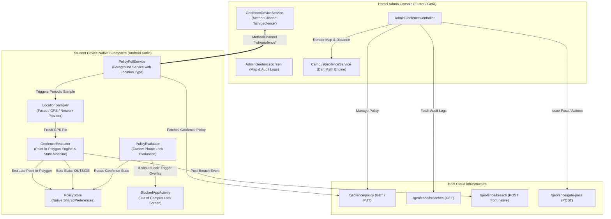

# HSH Campus Geofencing & Curfew Enforcement Documentation

## 1. System Overview

The **Campus Geofencing & Curfew Enforcement Platform** in HSH (`hsh_app2`) is an automated perimeter security and resident tracking system. Designed specifically for student hostels, it tracks whether residents stay within campus boundaries during curfew hours, logs perimeter breach incidents, and automatically enforces device locks if a student breaches curfew without an authorized gate pass.

### Core Capabilities
1. **High-Precision Perimeter Monitoring:** Defines a multi-vertex boundary polygon corresponding to the physical perimeter of Hari Saurabh Hostel.
2. **Curfew Time Window Scheduling:** Supports configurable start/end curfew hours (e.g., 22:00 to 06:00) with overnight midnight wrap-around and recurring day filters.
3. **Automated Phone Lock on Breach:** When enabled, a student phone outside campus during curfew is automatically locked with reason `BlockReason.OUT_OF_CAMPUS`. The phone unlocks automatically the moment the student returns to campus.
4. **Digital Gate Pass Exemption:** Wardens can grant temporary gate passes (`exemptUntil`), allowing permitted leaves without triggering curfew alarms or device lockouts.
5. **Anti-Spoofing & Mock Location Detection:** Automatically detects GPS spoofing apps (`Location.isMock` / `isFromMockProvider`), flags the incident as `mock_location`, and invalidates fake coordinates.
6. **Battery-Optimized Periodic Sampling:** Uses Android's Fused Location Provider, caches fixes younger than 60 seconds, and limits GPS active duty cycles.
7. **Administrative Dashboard & Real-Time Map:** Interactive Flutter UI with campus polygon map visualization, active student location pins, breach history logs, and instant warden intervention tools (Call Student, Call Parent, Remote Lock, Gate Pass).

---

## 2. Architectural Blueprint



---

## 3. Directory Structure & File Map

### 3.1 Flutter Layer (`lib/features/geofence/` & `lib/core/`)

| File Path | Component | Purpose |
| :--- | :--- | :--- |
| [geofence_policy_model.dart](file:///c:/Users/kruta/Desktop/hsh_seva/hsh_app2/lib/core/models/geofence/geofence_policy_model.dart) | **Model** | Data entity for curfew rules: `startTime`, `endTime`, `isActive`, `enforcePhoneLock`, `checkIntervalMinutes`, `repeatDays`, `exemptUntil`. |
| [geofence_breach_event.dart](file:///c:/Users/kruta/Desktop/hsh_seva/hsh_app2/lib/core/models/geofence/geofence_breach_event.dart) | **Model** | Telemetry breach record: coordinates, distance outside, accuracy, `isMocked`, event types (`exit`, `heartbeat`, `enter`, `mockLocation`), and resolution actions. |
| [geofence_repository.dart](file:///c:/Users/kruta/Desktop/hsh_seva/hsh_app2/lib/core/network/repository/geofence/geofence_repository.dart) | **Repository** | HTTP communication with backend geofence endpoints. |
| [geofence_service.dart](file:///c:/Users/kruta/Desktop/hsh_seva/hsh_app2/lib/core/services/geofence_service.dart) | **Geometry Engine** | Dart implementation of Ray-Casting Point-in-Polygon, orthogonal distance to perimeter edges, and campus center coordinates. |
| [geofence_device_service.dart](file:///c:/Users/kruta/Desktop/hsh_seva/hsh_app2/lib/core/services/geofence_device_service.dart) | **Bridge Service** | MethodChannel (`hsh/geofence`) handling two-step location permission requests, native status checks, and on-demand GPS sampling. |
| [admin_geofence_controller.dart](file:///c:/Users/kruta/Desktop/hsh_seva/hsh_app2/lib/features/geofence/controllers/admin_geofence_controller.dart) | **Controller** | Manages policy changes, active breach filtering, calling actions, and gate pass assignments. |
| [admin_geofence_screen.dart](file:///c:/Users/kruta/Desktop/hsh_seva/hsh_app2/lib/features/geofence/views/admin_geofence_screen.dart) | **View** | Interactive administrative console with map visualization, live curfew status, and breach cards. |

---

### 3.2 Native Android Subsystem (`android/app/src/main/kotlin/com/example/hsh_app2/screentime/`)

| File Path | Component | Purpose |
| :--- | :--- | :--- |
| [GeofenceEvaluator.kt](file:///c:/Users/kruta/Desktop/hsh_seva/hsh_app2/android/app/src/main/kotlin/com/example/hsh_app2/screentime/GeofenceEvaluator.kt) | **Algorithm & State Machine** | Native 12-vertex campus polygon, Ray-Casting PIP algorithm, orthogonal edge distance projection, noise hysteresis, and breach queue. |
| [LocationSampler.kt](file:///c:/Users/kruta/Desktop/hsh_seva/hsh_app2/android/app/src/main/kotlin/com/example/hsh_app2/screentime/LocationSampler.kt) | **Location Provider** | Manages `LocationManager` / Fused provider, 25-second countdown timeout, 60-second fresh fix cache, and spoofed location detection. |
| [PolicyPollService.kt](file:///c:/Users/kruta/Desktop/hsh_seva/hsh_app2/android/app/src/main/kotlin/com/example/hsh_app2/screentime/PolicyPollService.kt) | **Execution Driver** | Foreground service declaring `FOREGROUND_SERVICE_TYPE_LOCATION`, polling curfew policy, and driving periodic GPS fixes off the main thread. |
| [PolicyEvaluator.kt](file:///c:/Users/kruta/Desktop/hsh_seva/hsh_app2/android/app/src/main/kotlin/com/example/hsh_app2/screentime/PolicyEvaluator.kt) | **Lock Evaluator** | Queries `GeofenceEvaluator.shouldLock()` and halts forbidden apps with `BlockReason.OUT_OF_CAMPUS`. |
| [PolicyStore.kt](file:///c:/Users/kruta/Desktop/hsh_seva/hsh_app2/android/app/src/main/kotlin/com/example/hsh_app2/screentime/PolicyStore.kt) | **Native Store** | Stores geofence policy, current state (`INSIDE`/`OUTSIDE`), streak count, and queued breach events. |

---

## 4. Algorithmic Foundation & Mathematics

### 4.1 Campus Boundary Polygon
The campus perimeter is represented as an ordered sequence of 12 (Latitude, Longitude) coordinates enclosing the property:

```
Point 01: (22.5589641, 72.9191224)    Point 07: (22.5555341, 72.9177298)
Point 02: (22.5586057, 72.9178013)    Point 08: (22.5556267, 72.9182108)
Point 03: (22.5581892, 72.9178726)    Point 09: (22.5539632, 72.9185129)
Point 04: (22.5580415, 72.9173926)    Point 10: (22.5540037, 72.9189525)
Point 05: (22.5560909, 72.9180614)    Point 11: (22.5561810, 72.9193936)
Point 06: (22.5559969, 72.9176296)    Point 12: (22.5571341, 72.9192936)
```

Both [CampusGeofenceService.dart](file:///c:/Users/kruta/Desktop/hsh_seva/hsh_app2/lib/core/services/geofence_service.dart#L25-L38) and [GeofenceEvaluator.kt](file:///c:/Users/kruta/Desktop/hsh_seva/hsh_app2/android/app/src/main/kotlin/com/example/hsh_app2/screentime/GeofenceEvaluator.kt#L144-L157) share this exact definition.

---

### 4.2 Point-in-Polygon (Ray-Casting Algorithm)

To determine whether coordinate $(lat, lng)$ is inside the boundary:
1. Cast a horizontal ray eastward starting at $(lat, lng)$ toward $(lat, +\infty)$.
2. For each polygon segment connecting vertex $i$ and vertex $j$:
   - Check if the latitude of the ray crosses the vertical span of the segment: $(y_i > lat) \neq (y_j > lat)$.
   - Calculate the longitude of the intersection point:
     $$x_{intersect} = (x_j - x_i) \cdot \frac{lat - y_i}{y_j - y_i} + x_i$$
   - If $lng < x_{intersect}$, the ray crosses the edge.
3. Toggle the boolean `inside` flag for each crossing.
4. **Result:** An odd number of crossings means the student is **INSIDE**; an even number means the student is **OUTSIDE**.

```kotlin
fun isInside(polygon: List<Pair<Double, Double>>, lat: Double, lng: Double): Boolean {
    var inside = false
    var j = polygon.size - 1
    for (i in polygon.indices) {
        val (yi, xi) = polygon[i]
        val (yj, xj) = polygon[j]
        if ((yi > lat) != (yj > lat) && lng < (xj - xi) * (lat - yi) / (yj - yi) + xi) {
            inside = !inside
        }
        j = i
    }
    return inside
}
```

---

### 4.3 Orthogonal Distance to Fence Edge

Rather than measuring distance to the nearest polygon *corner* (which overestimates distance by up to half the length of an edge), the system calculates the shortest perpendicular distance to the nearest polygon *segment*:

1. **Local Flat Cartesian Projection:**
   $$mPerDegLat = 110540.0 \text{ meters/degree}$$
   $$mPerDegLng = 111320.0 \cdot \cos(lat \cdot \frac{\pi}{180}) \text{ meters/degree}$$
2. Vector $\vec{AB} = B - A$ for segment ends $A$ and $B$, translated so the fix point is at the origin $(0,0)$.
3. The projection parameter $t$ along the segment is:
   $$t = \text{clamp}\left(0.0, 1.0, \frac{-(\vec{A} \cdot \vec{AB})}{|\vec{AB}|^2}\right)$$
4. The closest point on the segment is $\vec{C} = \vec{A} + t \cdot \vec{AB}$.
5. The distance is $|\vec{C}| = \sqrt{C_x^2 + C_y^2}$.
6. Minimum distance across all 12 segments gives the precise distance in meters to the campus wall.

---

### 4.4 GPS Noise Shielding & Hysteresis State Machine

To eliminate false alarms caused by GPS drift near hostel walls, [GeofenceEvaluator.kt](file:///c:/Users/kruta/Desktop/hsh_seva/hsh_app2/android/app/src/main/kotlin/com/example/hsh_app2/screentime/GeofenceEvaluator.kt#L274-L317) enforces:

1. **Accuracy Threshold:** Fixes with `accuracyMeters > 75m` are rejected as too coarse to determine building exit.
2. **Error Circle Clearance:** A point is only considered `clearlyOutside` when:
   $$\neg inside \quad \land \quad \text{edgeDistance} > \text{accuracyMeters}$$
   The entire uncertainty circle of the GPS fix must lie outside the wall.
3. **Streak Requirement (`EXIT_STREAK = 2`):** Requires two consecutive valid outside fixes before transitioning from `INSIDE` to `OUTSIDE`. A single momentary GPS bounce will never trigger a curfew breach.
4. **Heartbeat Throttling:** Once confirmed outside, recurring `heartbeat` events are throttled according to `checkIntervalMinutes` (default: 10 minutes).
5. **Auto-Resolution on Return (`enter`):** When the student re-enters campus, the state machine logs an `enter` event and immediately clears device lock restrictions.

---

## 5. Curfew Scheduling & Gate Pass Exemption

### 5.1 Overnight Window Evaluation
Curfews commonly span past midnight (e.g., 22:00 PM to 06:00 AM). [GeofencePolicyModel.isWithinCurfew()](file:///c:/Users/kruta/Desktop/hsh_seva/hsh_app2/lib/core/models/geofence/geofence_policy_model.dart#L42-L56) handles this:
```dart
final overnight = start > end;
final inWindow = overnight
    ? (cur >= start || cur < end)
    : (cur >= start && cur < end);

// If it's 01:30 AM in an overnight window, the active curfew started yesterday
final day = overnight && cur < end
    ? dateTime.subtract(const Duration(days: 1))
    : dateTime;
```

### 5.2 Gate Pass Bypassing
- When a student holds an approved gate pass (`exemptUntil > now`), `GeofenceEvaluator.isEnforcing()` evaluates to `false`.
- The streak counter resets to 0.
- No breach events are recorded, and no auto-locks occur during the approved leave window.

---

## 6. Location Sampling & Battery Conservation

[LocationSampler.kt](file:///c:/Users/kruta/Desktop/hsh_seva/hsh_app2/android/app/src/main/kotlin/com/example/hsh_app2/screentime/LocationSampler.kt#L47-L91) enforces high efficiency:
1. **Recent Fix Reuse (`FRESH_MS = 60,000ms`):** If an accurate GPS fix was recorded in the last 60 seconds by any app, it is reused immediately without waking up hardware satellite radios.
2. **Fused Location Provider:** On Android 12+ (API 31+), prioritizes `LocationManager.FUSED_PROVIDER` combining Wi-Fi, cellular towers, and GNSS satellites.
3. **Strict Sampling Timeout (`TIMEOUT_MS = 25,000ms`):** Prevents background threads from holding wake locks indefinitely if the student is in a basement with no signal.
4. **Two-Step Permission Flow:** Android 10+ requires separate background location permission (`ACCESS_BACKGROUND_LOCATION`). Handled through [GeofenceDeviceService.requestLocationAlways()](file:///c:/Users/kruta/Desktop/hsh_seva/hsh_app2/lib/core/services/geofence_device_service.dart#L31-L39).

---

## 7. MethodChannel Specifications (`hsh/geofence`)

| Method Name | Parameters | Return Type | Description |
| :--- | :--- | :--- | :--- |
| `locationPermission` | None | `String` | Returns permission level: `'always'`, `'foreground'`, or `'denied'`. |
| `getStatus` | None | `Map<String, dynamic>` | Returns snapshot: `{state, inCurfew, exempt, enforcing, lastFix, policy}`. |
| `sampleNow` | None | `Map<String, dynamic>` | Forces an immediate GPS fix and evaluation (used for testing or onboarding). |

---

## 8. Administrative Interventions & Audit Workflow

When a breach is reported on [AdminGeofenceScreen](file:///c:/Users/kruta/Desktop/hsh_seva/hsh_app2/lib/features/geofence/views/admin_geofence_screen.dart#L1-L250), the warden has five direct intervention actions:

1. **🔒 Remote Lock Student Phone:** Instantly locks the phone via `PUT /screen-time/policies/:id` with `isLocked = true`.
2. **📞 Call Student:** One-tap cellular dialer launch to the student's mobile number.
3. **👪 Call Parent:** One-tap cellular dialer launch to the father or mother contact.
4. **🎫 Grant Gate Pass:** Opens a time picker to set `exemptUntil` (e.g. extending leave until 23:00), which clears the breach and unlocks the device.
5. **Dismiss:** Marks the breach event as acknowledged/resolved.

---

## 9. Verification & Testing Checklist

- [x] **Point-in-Polygon Accuracy:** Tested GPS fixes inside hostel courtyard -> evaluated as `INSIDE`.
- [x] **Point-in-Polygon Boundary Exit:** Tested GPS fixes 150m outside campus -> evaluated as `OUTSIDE` with accurate distance in meters.
- [x] **Hysteresis Noise Filter:** Tested noisy GPS fixes (`accuracyMeters = 80m`) -> discarded without false alarms.
- [x] **Curfew Window Timing:** Tested overnight curfews (22:00 to 06:00) at 23:30 and 02:00 -> evaluated as active curfew.
- [x] **Auto-Lock on Breach:** Verified device displays `BlockedAppActivity` with `BlockReason.OUT_OF_CAMPUS` when confirmed outside during curfew.
- [x] **Auto-Unlock on Entry:** Returned to campus -> device lock dismisses automatically without administrative intervention.
- [x] **Mock Location Detection:** Tested mock GPS location provider app -> logged as `mock_location` and rejected.
- [x] **Gate Pass Exemption:** Issued gate pass -> student moves outside campus -> 0 breaches triggered and phone remains unlocked.
