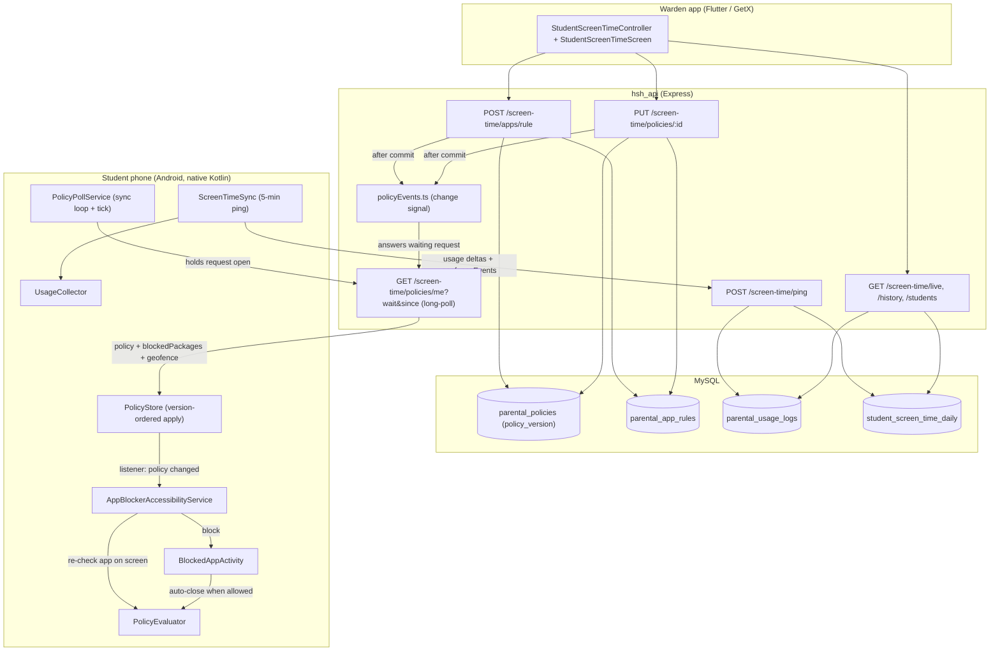

# Parental Control & Screen Time

> **Last updated:** 2026-10-10 · **Repos:** `hsh_app2` (Flutter + native Android) and `hsh_api` (Node/Express/MySQL)
>
> Paths starting with `lib/` or `android/` are in this repo; paths starting with `hsh_api/` are in the backend repo. Location tracking and curfew breaches are documented separately in [GEOFENCING_DOCS.md](GEOFENCING_DOCS.md).

---

## 1. What this feature does

Wardens (the operator console / platform admins) control and monitor each student's Android phone:

| Rule / feature | Behaviour on the student's phone |
| :--- | :--- |
| **Remote lock** | Every app except calls, keyboards, the launcher, Settings and this app is blocked until the warden unlocks. |
| **Blocked apps** | Individual apps (e.g. Instagram) are blocked. Takes effect immediately, **even if the app is already open**. |
| **Bedtime** | Apps are blocked inside a nightly window (e.g. 23:00–05:00). Off when no bedtime is set. |
| **Daily limit** | Apps are blocked once today's total screen time reaches the limit. 0 = no limit. |
| **Usage dashboard** | Today's total, per-app breakdown, 30-day history, online / screen-on / current app. |

All rules are enforced **on the phone**, so they keep working offline and with the app closed. Policy changes reach the phone **within about a second while its screen is on** (see section 4).

The curfew geofence **does not lock phones**; remote lock is the only lock wardens have.

---

## 2. Architecture

---

## 3. File map

### Flutter (`lib/`)

| File | Role |
| :--- | :--- |
| [screen_time_policy.dart](../lib/features/screentime/models/screen_time_policy.dart) | Policy model (`isLocked`, `blockedPackages`, `dailyLimitMinutes`, `bedtimeStart`, `bedtimeEnd`, `version`). `tryParse()` accepts snake_case and camelCase; an explicit `null` bedtime means "off"; `23:00:00` is shown as `23:00`. |
| [screen_time_service.dart](../lib/core/services/screen_time_service.dart) | `hsh/screen_time` MethodChannel: permissions, start/stop monitoring, `syncNow`, `refreshPolicy`, `getPolicy`, `getCompliance`. |
| [student_screen_time_controller.dart](../lib/features/screentime/controllers/student_screen_time_controller.dart) | Warden dashboard: student directory and filters, live status, history, and policy actions. |
| [student_screen_time_screen.dart](../lib/features/screentime/views/student_screen_time_screen.dart) | Warden dashboard UI. Route `Routes.studentScreenTime`. |
| [parental_controls_card.dart](../lib/features/screentime/widgets/parental_controls_card.dart) | Lock/unlock, curfew, daily limit and blocked-apps tiles; shows "Off" when no bedtime is set. |
| [restrict_app_sheet.dart](../lib/features/screentime/widgets/restrict_app_sheet.dart), [curfew_settings_sheet.dart](../lib/features/screentime/widgets/curfew_settings_sheet.dart) | Block an app; set bedtime and daily limit. |
| [device_setup_screen.dart](../lib/features/screentime/views/device_setup_screen.dart) | Student onboarding: Usage access, App blocker (Accessibility), Location "all the time", Battery exemption. |
| [home_controller.dart](../lib/features/home/controllers/home_controller.dart) | On student login/resume: sends the student to setup if a required permission is missing, then calls `syncNow()` and `refreshPolicy()`. |
| [session_store.dart](../lib/core/storage/session_store.dart) | Starts monitoring for student/leader sessions; stops it on logout. |

### Native Android (`android/app/src/main/kotlin/com/example/hsh_app2/screentime/`)

| File | Role |
| :--- | :--- |
| [PolicyPollService.kt](../android/app/src/main/kotlin/com/example/hsh_app2/screentime/PolicyPollService.kt) | Foreground service. **Sync loop:** long-polls the policy (section 4). **Tick** (30 s screen on / 60 s off): geofence work and a re-check of the app on screen for time-based rules. |
| [ScreenTimeSync.kt](../android/app/src/main/kotlin/com/example/hsh_app2/screentime/ScreenTimeSync.kt) | Usage delta ping every 5 minutes (WorkManager tick + 15-min watchdog); `fetchAndSavePolicy()`, the single native policy fetch. |
| [PolicyStore.kt](../android/app/src/main/kotlin/com/example/hsh_app2/screentime/PolicyStore.kt) | Encrypted storage of the session token, policy and backend `policy_version`. `applyPolicyJson()` discards responses older than the applied version and notifies listeners on change. |
| [AppBlockerAccessibilityService.kt](../android/app/src/main/kotlin/com/example/hsh_app2/screentime/AppBlockerAccessibilityService.kt) | Blocks apps when they are opened **and** re-checks the app already on screen whenever the policy changes. |
| [PolicyEvaluator.kt](../android/app/src/main/kotlin/com/example/hsh_app2/screentime/PolicyEvaluator.kt) | The rule engine (`BlockReason`: device locked, app blocked, bedtime, daily limit) and the always-allowed packages. |
| [BlockedAppActivity.kt](../android/app/src/main/kotlin/com/example/hsh_app2/screentime/BlockedAppActivity.kt) | Full-screen block screen; closes itself as soon as the app is allowed again. |
| [UsageCollector.kt](../android/app/src/main/kotlin/com/example/hsh_app2/screentime/UsageCollector.kt) | Per-app foreground time from usage events; current foreground package. |
| [ScreenTimeWorker.kt](../android/app/src/main/kotlin/com/example/hsh_app2/screentime/ScreenTimeWorker.kt) | WorkManager job: runs the ping and restarts `PolicyPollService` if the OS killed it. |
| [BootPolicyReceiver.kt](../android/app/src/main/kotlin/com/example/hsh_app2/screentime/BootPolicyReceiver.kt) | Restarts sync and the poll service after reboot or app update. |

### Backend (`hsh_api/src/`)

| File | Role |
| :--- | :--- |
| `modules/screentime/screentime.routes.ts` | All `/screen-time/*` endpoints, access rules, long-poll, transactional writes. |
| `services/policyEvents.ts` | In-process signal: `notifyPolicyChanged(studentId)` after a commit answers that student's waiting long-poll. |
| `modules/geofence/geofence.service.ts` | `findStudentId()` (numeric `students.id` **only**; bank codes / `student_code` are never matched) and the geofence payload included in `/policies/me`. |
| `config/db.ts` | Startup migrations for the parental tables. |

---

## 4. How a policy change reaches the phone

1. **Warden action.**
   - Blocking/unblocking one app → `POST /screen-time/apps/rule`.
   - Lock/unlock → `PUT /policies/:id` with `{is_locked}` only.
   - Bedtime and limit → `PUT` with just those fields.
2. **Backend commit.** `policy_version` is bumped in the **same transaction** as the change (the bump comes first and row-locks the policy, so concurrent edits get strictly ordered versions). After the commit `notifyPolicyChanged(studentId)` fires.
3. **Delivery.** With the screen on, the phone keeps `GET /screen-time/policies/me?wait=25&since=<version>` open:
   - if the stored version is already newer than `since`, the server answers at once;
   - otherwise it holds the request until the signal fires (answers in about a round-trip) or 25 s pass, then returns the current policy;
   - the response carries `longPoll: true`, and the phone immediately opens the next request.
4. **Apply.** `PolicyStore.applyPolicyJson()` ignores a response whose `policy_version` is older than the one already applied (concurrent fetches can land out of order). A lower version is accepted again after 2 minutes, covering a genuine server-side reset.
5. **Enforce.** On a real change, listeners fire. `AppBlockerAccessibilityService` re-checks the app currently on screen; if it is now blocked, the student is sent home and the block screen appears. If an app is unblocked, an open block screen closes.

**Other cadences:**

| Situation | Behaviour |
| :--- | :--- |
| Screen off | Plain fetch every 120 s; the screen-on broadcast wakes the loop and triggers an immediate fetch and re-check. |
| Offline / server error | Retry with backoff 5 s → 60 s. The last good policy keeps being enforced. |
| Network restored / background data enabled | ConnectivityManager callback wakes the sync loop immediately, resets backoff, and ensures sync ticks are scheduled. |
| Server without long-poll support | Plain fetch every 30 s (detected by the missing `longPoll` flag). |
| Student opens the app | `ScreenTimeService.refreshPolicy()` wakes the loop for an immediate fetch. |
| Every ping (5 min) | The response echoes the policy (same consistent snapshot); stale echoes are discarded by the version check. |

**Single writer:** only the native side writes the enforced policy. Flutter no longer pushes policies to native (`syncPolicyToNative` was removed), which eliminated an unversioned overwrite race.

**Consistent reads:** `GET /policies/me` and the ping echo read the policy and app rules in one `REPEATABLE READ` snapshot, so a version always matches the rules returned with it. A student without a policy row is version 0.

---

## 5. Enforcement on the phone

### 5.1 Rule order (`PolicyEvaluator.evaluate`)

1. This app itself and protected packages → always allowed.
2. `isLocked` → `DEVICE_LOCKED`.
3. Package in `blockedPackages` → `APP_BLOCKED`.
4. Inside the bedtime window (overnight wrap supported) → `BEDTIME`.
5. Daily limit set and today's minutes ≥ limit → `DAILY_LIMIT`.

**Protected packages (never blocked):** dialers, in-call UI, emergency, system UI, Settings (incl. Samsung), permission controller, package installer, Google Play services, plus every enabled keyboard, home launcher and dialer discovered at runtime.

### 5.2 When the check runs

| Trigger | What is checked |
| :--- | :--- |
| App opened or switched to (`TYPE_WINDOW_STATE_CHANGED`) | That app; also triggers self-healing watchdog ensuring `PolicyPollService` and WorkManager sync are alive |
| Policy changed (listener) | The app on screen |
| Accessibility service (re)connects | The app on screen; also revives `PolicyPollService` if stopped |
| Every poll tick (30 s screen on) | The app on screen, so bedtime starting or the daily limit being reached mid-use takes effect |
| Screen turns on | The app on screen |

"App on screen" is the last activity window the accessibility service saw; dialogs, keyboards and the notification shade are ignored. If nothing has been seen yet (service just connected), Android usage events are used. A check that raced an app switch is dropped, so it can never block an app the student has already left.

### 5.3 Block screen

`BlockedAppActivity` shows the app icon, reason and package. "Return to Home Screen" and Back go to the launcher; "Open HSH Seva" opens this app. It closes itself when the policy changes to allow the app, re-checking every 3 s while visible.

---

## 6. Usage telemetry

- `UsageCollector` rebuilds per-app foreground time from raw usage events (RESUMED/PAUSED pairs, closed by screen-off, keyguard or shutdown), clamped to local midnight.
- `ScreenTimeSync` sends **only new whole minutes** per app (leftover seconds carry over), so the backend can add deltas without double-counting. After midnight it first flushes the tail of the previous day.
- Each ping writes everything in **one transaction**. The phone only advances its "already reported" counters and drops its geofence-event queue after a 2xx, so a failed or retried ping never double-counts or loses data.
- "Online" on the dashboard means a ping within the last 10 minutes.

---

## 7. Warden dashboard

Operator home → **Screen Time**. Allowed app roles: `canViewScreenTime` (admin, warden); allowed backend roles: operator, platform-admin.

**Students are identified only by their numeric `students.id`** (the `id` of a directory entry). Every request for the selected student uses it; there is no fallback to bank codes or names. Another screen can open a student directly by passing `{id}` (or a numeric `studentId`) as route arguments. The phonebook has no `students.id`, so it passes `{name, room}` and the directory opens searched by that name; the warden then taps the student. The directory search box is sent to the server, so it searches every student, not just the 100 shown unfiltered.

- **Directory:** all students with today's minutes, online, screen-on, current app and locked state. Filters: All, Online, Locked, Restricted, Night, Attention.
- **Student detail:**
  - live status and usage hero (today vs limit);
  - per-app list with categories (Social Media, Entertainment, Gaming, Study & Tools, Other) and a Restrict button;
  - 30-day history;
  - parental controls card: lock/unlock (with confirmation), curfew & daily limit sheet, restrict-app sheet.
- Each action is applied optimistically and rolled back with an error message if the server rejects it.

---

## 8. API reference

Mounted at both `/api/screen-time/...` and `/screen-time/...`; all require a Bearer token. "Self" means a student reading their own data (no id, `me`, or their own id). A student identifier is always a numeric `students.id` without leading zeros; anything else (a bank code like `0768`, `HSH-…`) returns 404. Responses use `{ success, message?, data? }`.

| Method & path | Who | Notes |
| :--- | :--- | :--- |
| `POST /ping` | Student's own phone (supervisor may pass `student_id`) | Body: `date`, `totalScreenTimeMinutes`, `isScreenOn`, `currentApp`, `appUsageBreakdown[]`, `geofenceEvents[]`, `deviceUuid?`. Response echoes `policy` (with `policy_version`) and `blockedPackages`. |
| `POST /inventory` | Student's own phone | `{ apps: [{packageName, appName}] }` |
| `GET /live/:id?` | Self or supervisor | Today's status, `appUsageBreakdown`, `policy`, `blockedPackages`, `lastPing` |
| `GET /history/:id?` | Self or supervisor | Last 30 days |
| `GET /students?search=` | Supervisor | Directory (max 100) |
| `GET /policies/:id?` | Self or supervisor | `{ policy, apps, blockedPackages, geofence }`. Long-poll with `?wait=<s ≤ 25>&since=<version>` (self only); response has `longPoll`. |
| `PUT /policies/:id` | Supervisor | **Partial:** any of `is_locked`, `daily_limit_minutes` (0–1440), `bedtime_start`/`bedtime_end` (`HH:mm`, or `''`/`null` to clear both), `blockedPackages` (complete set). camelCase accepted. |
| `POST /apps/rule` | Supervisor | `{ student_id, package_name, app_name?, is_blocked, daily_limit_minutes? }`. One app; version bump + rule in one transaction. |

**Supervisor** = `requireRole('operator')`: the operator console token and platform-admin staff. Students can no longer change their own policy (previously a student could unlock themselves).

---

## 9. Database (created by `hsh_api/src/config/db.ts`)

| Table | Purpose |
| :--- | :--- |
| `parental_policies` | One row per student: `policy_version`, `daily_limit_minutes`, `bedtime_start`, `bedtime_end`, `is_locked`, `updated_at` |
| `parental_app_rules` | Per student and package: `app_name`, `is_blocked`, `daily_limit_minutes` |
| `parental_usage_logs` | Per student, date and package: `usage_minutes` |
| `student_screen_time_daily` | Per student and date: totals, `is_screen_on`, `current_app`, `last_ping` |
| `student_devices` | Device UUID → student (moves to the new student when a phone is re-used) |

---

## 10. MethodChannel `hsh/screen_time`

| Method | Description |
| :--- | :--- |
| `hasUsagePermission` / `openUsageSettings` | Usage access check / Settings page |
| `hasAccessibilityPermission` / `openAccessibilitySettings` | App blocker check / Settings page |
| `isBatteryOptimizationIgnored` / `requestIgnoreBatteryOptimizations` | Battery exemption |
| `startMonitoring` `{token, baseUrl}` | Saves the session natively, schedules the ping, starts `PolicyPollService` |
| `stopMonitoring` | Cancels work, clears the session, resets the policy and all per-student state |
| `syncNow` | Immediate ping → `ok` / `no_permission` / `no_session` / `unauthorized` / `error` |
| `refreshPolicy` | Wakes the native sync loop for an immediate policy fetch |
| `getPolicy` / `getBlockedPackages` / `getCompliance` | Read what the phone currently enforces / reports |

---

## 11. Permissions

`PACKAGE_USAGE_STATS` (granted in Settings → Usage access), the Accessibility service `AppBlockerAccessibilityService` (`BIND_ACCESSIBILITY_SERVICE`, listens to `typeWindowStateChanged`), `RECEIVE_BOOT_COMPLETED`, `FOREGROUND_SERVICE` + `FOREGROUND_SERVICE_SPECIAL_USE` (+ `_LOCATION`), `REQUEST_IGNORE_BATTERY_OPTIMIZATIONS`, `POST_NOTIFICATIONS`. `BlockedAppActivity` is `singleTask`, excluded from recents, full-screen.

---

## 12. Testing

**Backend (run 2026-10-05/06 against a local MySQL with throwaway students, via ad-hoc `tsx` scripts that are not committed):**

- a restriction reaches a waiting long-poll about 0.5 s after the warden's request starts;
- "behind" phones are answered immediately and an idle request is held until its wait expires;
- multiple apps, unblock-one-keeps-others, 13 concurrent toggles → version +13 and the last change wins, with no response pairing a version with the wrong rules;
- lock and gate pass also wake the phone; aborted connections are handled; wardens can't long-poll another student;
- access rules (students can't read others or unlock themselves); partial PUT keeps other fields; bedtime clearing;
- student ids only (2026-10-06): a bank code equal to another student's id (`0<id>`) is rejected for reads, locks and app blocks, while the numeric id targets exactly that student.

All checks passed. Native code compiles; `flutter analyze` is clean.

**On a real student phone (not yet run):**

- [ ] Student using App A → warden blocks App A → App A is closed and the block screen appears within about a second.
- [ ] Warden blocks App B while the student uses App A → opening App B is blocked immediately.
- [ ] Warden unblocks App A → the block screen closes and App A opens without a restart.
- [ ] Block several apps; toggle one repeatedly; the final state always wins.
- [ ] Remote lock and unlock apply within about a second (screen on).
- [ ] Bedtime starting while an app is open blocks it within 30 s.
- [ ] Turn on airplane mode, change rules, reconnect → the latest rules apply and nothing older overrides them.
- [ ] Reboot → monitoring resumes without opening the app.
- [ ] Calls, emergency dialer and keyboard still work while locked.

---

## 13. Known limitations

- **Telemetry the backend ignores:** the ping carries `compliance` (usage access, accessibility, battery exemption, app version…), `blockEvents`, app icons, `deviceTime` and `currentPackage`, but the backend doesn't store them. The dashboard's **Attention** (tamper) filter therefore never matches.
- **Night minutes:** the phone never sends `nightScreenTimeMinutes`, so night minutes stay 0 and the **Night** filter shows nobody.
- **Old app builds and bank codes:** a warden phone still on a build from before 2026-10-06 sends the bank code when opening Screen Time from the phonebook. Codes with a leading zero (`0001`–`0999`) are now rejected (nothing opens). Codes `1000` and up are plain numbers, so the backend reads them as a student id and can still open the wrong student until that phone updates.
- **Single backend process for instant delivery.** The change signal is in-process. With several API processes, changes still arrive, but up to 25 s later.
- **Screen off:** changes arrive within 120 s, or immediately when the screen turns on.
- **Missed app switch:** if Android never reports that the student left an app, the re-check falls back to usage events. If those are unavailable too, nothing is blocked until the next switch (it fails open rather than blocking the wrong app).
- **Old app builds** still push the policy from Flutter without a version and don't re-check the open app; the new backend still serves them correctly.
- **Android only:** iOS student phones are not monitored.
