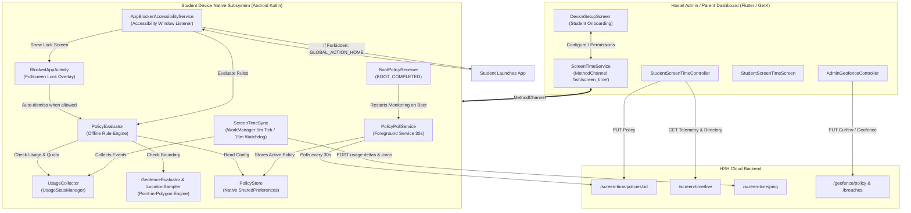

# HSH Parental Control & Device Screen Time System Documentation

## 1. System Overview

The **Parental Control & Screen Time Monitoring System** in HSH (`hsh_app2`) is an enterprise-grade mobile device management and digital wellbeing platform tailored for student hostel environments. It allows Hostel Wardens and Parents to supervise student smartphone usage, eliminate digital distractions during study/curfew hours, and ensure student safety through automated location geofencing.

### Core Capabilities
1. **Instant Remote Device Lock:** Wardens can immediately lock a student's device remotely with a single tap.
2. **Automated Bedtime Curfew:** Enforces scheduled overnight device lockouts (e.g., 23:00 to 05:00) with midnight wrap-around support.
3. **Daily Screen Time Allowance:** Sets daily quotas (e.g., 2 hours/day); non-essential apps are automatically restrained once quota is reached.
4. **Targeted App Blacklisting:** Granular restriction of distracting packages (Instagram, YouTube, BGMI, etc.) while keeping educational and communication tools usable.
5. **Geofence Curfew & Campus Perimeter Enforcement:** Evaluates physical student coordinates against campus boundary polygons; auto-locks phones if a student is outside campus during curfew hours without an active gate pass.
6. **Live Telemetry & Heartbeat:** Reports active foreground app, screen-on state, battery percentage, network status, and last-seen timestamp.
7. **Anti-Tampering Compliance Auditing:** Monitors Android system permissions (Usage Access, Accessibility, Battery Optimizations) and alerts administrators if a student attempts to disable monitoring.
8. **Emergency & Safety Guarantees:** Keyboards, phone dialers, emergency calling, and system settings are strictly protected and never blocked.

---

## 2. Architectural Blueprint



---

## 3. Directory Structure & File Map

### 3.1 Flutter Layer (`lib/features/screentime/` & `lib/features/geofence/`)

| File Path | Component | Purpose |
| :--- | :--- | :--- |
| [screen_time_policy.dart](file:///c:/Users/kruta/Desktop/hsh_seva/hsh_app2/lib/features/screentime/models/screen_time_policy.dart) | **Model** | Data entity for device policy: `isLocked`, `blockedPackages`, `dailyLimitMinutes`, `bedtimeStart`, `bedtimeEnd`, and `version`. |
| [screen_time_service.dart](file:///c:/Users/kruta/Desktop/hsh_seva/hsh_app2/lib/core/services/screen_time_service.dart) | **Bridge Service** | MethodChannel (`hsh/screen_time`) handling Android permissions, monitoring start/stop, and immediate policy pushing. |
| [student_screen_time_controller.dart](file:///c:/Users/kruta/Desktop/hsh_seva/hsh_app2/lib/features/screentime/controllers/student_screen_time_controller.dart) | **Controller** | Primary GetX controller for directory filters (`All`, `Online`, `Locked`, `Restricted`, `Night`, `Attention`), real-time telemetry polling, and policy updates. |
| [student_screen_time_screen.dart](file:///c:/Users/kruta/Desktop/hsh_seva/hsh_app2/lib/features/screentime/views/student_screen_time_screen.dart) | **View** | Admin / parent screen time dashboard with usage gauges, category bars, live status, and app lists. |
| [device_setup_screen.dart](file:///c:/Users/kruta/Desktop/hsh_seva/hsh_app2/lib/features/screentime/views/device_setup_screen.dart) | **View** | 4-step student device onboarding wizard (Usage Stats, Accessibility, Battery Optimizations, Location). |
| [parental_controls_card.dart](file:///c:/Users/kruta/Desktop/hsh_seva/hsh_app2/lib/features/screentime/widgets/parental_controls_card.dart) | **Widget** | Toggle controls for Remote Lock, Bedtime hours, and quick restrictions. |
| [live_status_card.dart](file:///c:/Users/kruta/Desktop/hsh_seva/hsh_app2/lib/features/screentime/widgets/live_status_card.dart) | **Widget** | Live heartbeat widget showing online badge, battery level, active app, and last seen. |
| [usage_hero_card.dart](file:///c:/Users/kruta/Desktop/hsh_seva/hsh_app2/lib/features/screentime/widgets/usage_hero_card.dart) | **Widget** | Hero radial / progress gauge comparing today's usage against daily limit allowance. |
| [app_usage_card.dart](file:///c:/Users/kruta/Desktop/hsh_seva/hsh_app2/lib/features/screentime/widgets/app_usage_card.dart) | **Widget** | App item with launcher icon, usage duration, category badge, and quick Restrict button. |
| [restrict_app_sheet.dart](file:///c:/Users/kruta/Desktop/hsh_seva/hsh_app2/lib/features/screentime/widgets/restrict_app_sheet.dart) | **Widget** | Modal sheet to blacklist packages or adjust restrictions. |
| [curfew_settings_sheet.dart](file:///c:/Users/kruta/Desktop/hsh_seva/hsh_app2/lib/features/screentime/widgets/curfew_settings_sheet.dart) | **Widget** | Time picker sheet for Bedtime curfew start/end and daily limit sliders. |
| [student_directory_view.dart](file:///c:/Users/kruta/Desktop/hsh_seva/hsh_app2/lib/features/screentime/widgets/student_directory_view.dart) | **Widget** | Directory view listing all students with real-time status pills. |
| [admin_geofence_controller.dart](file:///c:/Users/kruta/Desktop/hsh_seva/hsh_app2/lib/features/geofence/controllers/admin_geofence_controller.dart) | **Controller** | Manages campus geofence perimeter coordinates, curfew hours, and breach audit logs. |
| [admin_geofence_screen.dart](file:///c:/Users/kruta/Desktop/hsh_seva/hsh_app2/lib/features/geofence/views/admin_geofence_screen.dart) | **View** | Map and audit interface to manage campus geofence perimeters. |

---

### 3.2 Native Android Subsystem (`android/app/src/main/kotlin/com/example/hsh_app2/screentime/`)

| File Path | Component | Purpose |
| :--- | :--- | :--- |
| [AppBlockerAccessibilityService.kt](file:///c:/Users/kruta/Desktop/hsh_seva/hsh_app2/android/app/src/main/kotlin/com/example/hsh_app2/screentime/AppBlockerAccessibilityService.kt) | **Accessibility** | Window state listener (`TYPE_WINDOW_STATE_CHANGED`) that detects foreground app launches and triggers instant blocking. |
| [BlockedAppActivity.kt](file:///c:/Users/kruta/Desktop/hsh_seva/hsh_app2/android/app/src/main/kotlin/com/example/hsh_app2/screentime/BlockedAppActivity.kt) | **Activity** | Fullscreen lock overlay (`FLAG_SHOW_WHEN_LOCKED`, `FLAG_DISMISS_KEYGUARD`). Auto-dismisses when policy changes. |
| [PolicyEvaluator.kt](file:///c:/Users/kruta/Desktop/hsh_seva/hsh_app2/android/app/src/main/kotlin/com/example/hsh_app2/screentime/PolicyEvaluator.kt) | **Rule Engine** | Offline evaluation engine checking Remote Lock, Bedtime Curfew, Daily Limit, App Blocklist, and Geofence Breaches. |
| [PolicyPollService.kt](file:///c:/Users/kruta/Desktop/hsh_seva/hsh_app2/android/app/src/main/kotlin/com/example/hsh_app2/screentime/PolicyPollService.kt) | **Foreground Service** | Maintains active polling (30s active / 120s idle) with notification to survive OEM process kills and execute lock commands in real time. |
| [PolicyStore.kt](file:///c:/Users/kruta/Desktop/hsh_seva/hsh_app2/android/app/src/main/kotlin/com/example/hsh_app2/screentime/PolicyStore.kt) | **Persistence** | Thread-safe native SharedPreferences store for session tokens, policies, and breach logs. |
| [UsageCollector.kt](file:///c:/Users/kruta/Desktop/hsh_seva/hsh_app2/android/app/src/main/kotlin/com/example/hsh_app2/screentime/UsageCollector.kt) | **Usage Telemetry** | Reads raw `UsageEvents` from Android's `UsageStatsManager`, matching RESUMED/PAUSED event pairs aligned with local midnight. |
| [ScreenTimeSync.kt](file:///c:/Users/kruta/Desktop/hsh_seva/hsh_app2/android/app/src/main/kotlin/com/example/hsh_app2/screentime/ScreenTimeSync.kt) | **Telemetry Reporter** | WorkManager scheduled engine pushing minute usage deltas, battery, compliance, and launcher icons to the backend. |
| [ScreenTimeWorker.kt](file:///c:/Users/kruta/Desktop/hsh_seva/hsh_app2/android/app/src/main/kotlin/com/example/hsh_app2/screentime/ScreenTimeWorker.kt) | **WorkManager** | 15-minute periodic watchdog and 5-minute recurring tick worker. |
| [GeofenceEvaluator.kt](file:///c:/Users/kruta/Desktop/hsh_seva/hsh_app2/android/app/src/main/kotlin/com/example/hsh_app2/screentime/GeofenceEvaluator.kt) | **Geofence Engine** | Implements ray-casting point-in-polygon algorithm to check if GPS fixes fall within campus boundaries during curfew. |
| [LocationSampler.kt](file:///c:/Users/kruta/Desktop/hsh_seva/hsh_app2/android/app/src/main/kotlin/com/example/hsh_app2/screentime/LocationSampler.kt) | **Location Provider** | Battery-efficient location sampler using Fused / GPS / Network providers. |
| [BootPolicyReceiver.kt](file:///c:/Users/kruta/Desktop/hsh_seva/hsh_app2/android/app/src/main/kotlin/com/example/hsh_app2/screentime/BootPolicyReceiver.kt) | **Broadcast Receiver** | Listens for `BOOT_COMPLETED` and `MY_PACKAGE_REPLACED` to immediately restart the poller and WorkManager tasks. |

---

## 4. In-Depth Technical Implementation

### 4.1 Policy Enforcement & Blocking Mechanism

1. **Window Interception:**
   When the student opens an application, Android dispatches an `AccessibilityEvent.TYPE_WINDOW_STATE_CHANGED` to [AppBlockerAccessibilityService.kt](file:///c:/Users/kruta/Desktop/hsh_seva/hsh_app2/android/app/src/main/kotlin/com/example/hsh_app2/screentime/AppBlockerAccessibilityService.kt#L41-L61).
2. **Offline Rule Evaluation:**
   [PolicyEvaluator.evaluate()](file:///c:/Users/kruta/Desktop/hsh_seva/hsh_app2/android/app/src/main/kotlin/com/example/hsh_app2/screentime/PolicyEvaluator.kt#L79-L92) is executed immediately on-device:
   ```kotlin
   if (policy.isLocked) return BlockReason.DEVICE_LOCKED
   if (GeofenceEvaluator.shouldLock(context)) return BlockReason.OUT_OF_CAMPUS
   if (packageName in policy.blockedPackages) return BlockReason.APP_BLOCKED
   if (policy.hasBedtime && isInBedtime(policy)) return BlockReason.BEDTIME
   if (policy.dailyLimitMinutes > 0 && todayMinutes(context) >= policy.dailyLimitMinutes) {
       return BlockReason.DAILY_LIMIT
   }
   ```
3. **App Dismissal & Replacement:**
   If a violation is found:
   - The service executes `performGlobalAction(GLOBAL_ACTION_HOME)` to immediately minimize the restricted application.
   - It launches [BlockedAppActivity](file:///c:/Users/kruta/Desktop/hsh_seva/hsh_app2/android/app/src/main/kotlin/com/example/hsh_app2/screentime/BlockedAppActivity.kt#L26-L32) with flags `FLAG_ACTIVITY_NEW_TASK | FLAG_ACTIVITY_CLEAR_TOP`.
4. **Self-Releasing Lock Screen:**
   [BlockedAppActivity](file:///c:/Users/kruta/Desktop/hsh_seva/hsh_app2/android/app/src/main/kotlin/com/example/hsh_app2/screentime/BlockedAppActivity.kt#L40-L50) registers a 3-second recurring runnable checking `PolicyEvaluator.evaluate()`. As soon as the warden unlocks the device, the curfew expires, or the student enters campus, the lock screen self-dismisses back to the home launcher without requiring user action.

---

### 4.2 Protected System Safeties (Anti-Brick Protection)

Under no circumstances should parental control render a smartphone unusable for emergencies. [PolicyEvaluator.kt](file:///c:/Users/kruta/Desktop/hsh_seva/hsh_app2/android/app/src/main/kotlin/com/example/hsh_app2/screentime/PolicyEvaluator.kt#L51-L70) explicitly protects:
- **Phone Dialers & Emergency Services:** `com.android.dialer`, `com.google.android.dialer`, `com.samsung.android.dialer`, `com.android.emergency`, `com.android.incallui`, and intent `android.intent.action.DIAL_EMERGENCY`.
- **Keyboards / Input Methods:** Dynamically discovers all active IMEs via `InputMethodManager.enabledInputMethodList` so students can type in emergency chats or the HSH app.
- **Home Launchers:** System home launchers are discovered at runtime (`Intent.CATEGORY_HOME`).
- **Core System Services:** `android`, `com.android.systemui`, `com.android.settings`, `com.android.permissioncontroller`, `com.google.android.gms`.
- **The HSH Host App itself.**

---

### 4.3 High-Precision Usage Stats Aggregation

Standard Android `UsageStatsManager.queryUsageStats()` produces inaccurate aggregate buckets that drift from local midnight. To solve this, [UsageCollector.kt](file:///c:/Users/kruta/Desktop/hsh_seva/hsh_app2/android/app/src/main/kotlin/com/example/hsh_app2/screentime/UsageCollector.kt#L87-L140):
1. Queries raw events using `UsageStatsManager.queryEvents(dayStart - 6_HOURS, now)`.
2. Reconstructs state by pairing `ACTIVITY_RESUMED` (1) with `ACTIVITY_PAUSED` (2), `SCREEN_NON_INTERACTIVE` (16), `KEYGUARD_SHOWN` (17), or `DEVICE_SHUTDOWN` (26).
3. Clamps intervals strictly within `[dayStart, now)` so only today's usage counts toward the daily limit.
4. Categorizes applications automatically based on package names into **Productive**, **Social**, **Entertainment**, **Gaming**, and **Utility**.

---

### 4.4 Delta Sync Protocol & Background Resilience

- **Delta Accumulation:** Devices track previously reported usage minutes per app in SharedPreferences (`key_reported_minutes_YYYY-MM-DD`). Only the delta (new minutes) is sent to `POST /screen-time/ping`.
- **Zero Loss / No Double-Counting:** Leftover seconds under 60 carry over to the next tick.
- **Foreground Service ([PolicyPollService](file:///c:/Users/kruta/Desktop/hsh_seva/hsh_app2/android/app/src/main/kotlin/com/example/hsh_app2/screentime/PolicyPollService.kt)):** Runs as a persistent foreground service with `FOREGROUND_SERVICE_TYPE_SPECIAL_USE` and `FOREGROUND_SERVICE_TYPE_LOCATION`. Polls `/screen-time/policies/me` every 30 seconds while screen is on, and every 120 seconds when screen is idle.
- **WorkManager Watchdog:** A periodic 15-minute `PeriodicWorkRequest` coupled with a self-chaining 5-minute `OneTimeWorkRequest` guarantees that telemetry pings continue even if battery saver or task killers kill background threads.

---

### 4.5 Campus Geofencing & Curfew Point-in-Polygon Engine

- **Boundary Polygon:** Defined in [GeofenceEvaluator.kt](file:///c:/Users/kruta/Desktop/hsh_seva/hsh_app2/android/app/src/main/kotlin/com/example/hsh_app2/screentime/GeofenceEvaluator.kt#L120-L160) as a series of (Latitude, Longitude) coordinates enclosing the hostel campus.
- **Ray-Casting Algorithm:** [GeofenceEvaluator.contains()](file:///c:/Users/kruta/Desktop/hsh_seva/hsh_app2/android/app/src/main/kotlin/com/example/hsh_app2/screentime/GeofenceEvaluator.kt#L230-L260) casts a ray eastward from the student's GPS coordinate and counts intersections with boundary polygon edges. Odd count = inside campus; even count = outside campus.
- **Curfew Window Check:** Evaluates if local time falls within configured start/end times (`22:00` to `06:00`).
- **Gate Pass Exemption:** If the student holds an active digital gate pass (`exemptUntil > System.currentTimeMillis()`), breach penalties and auto-locks are bypassed.
- **Breach Actions:** If `lockOnBreach` is enabled and student is outside without pass:
  - Phone automatically locks with reason `BlockReason.OUT_OF_CAMPUS`.
  - Breach event with location, accuracy, and timestamp is queued and dispatched to `POST /geofence/breach`.

---

## 5. MethodChannel Specifications (`hsh/screen_time`)

| Method Name | Parameters | Return Type | Description |
| :--- | :--- | :--- | :--- |
| `hasUsagePermission` | None | `bool` | Checks if `PACKAGE_USAGE_STATS` is granted. |
| `openUsageSettings` | None | `void` | Directs user to Settings > Usage Access page. |
| `hasAccessibilityPermission` | None | `bool` | Checks if `AppBlockerAccessibilityService` is active. |
| `openAccessibilitySettings` | None | `void` | Directs user to Settings > Accessibility page. |
| `isBatteryOptimizationIgnored`| None | `bool` | Checks if app is whitelisted from battery restrictions. |
| `requestIgnoreBatteryOptimizations`| None | `bool` | Prompts OS dialog for battery optimization exemption. |
| `startMonitoring` | `token`, `baseUrl` | `void` | Saves auth session natively and boots `PolicyPollService` & `ScreenTimeSync`. |
| `stopMonitoring` | None | `void` | Clears credentials, cancels WorkManager, resets policy. |
| `syncNow` | None | `String` | Forces immediate usage calculation and HTTP sync (`ok`, `no_permission`, etc.). |
| `syncPolicyToNative` | `ScreenTimePolicy` map | `bool` | Pushes policy directly into local `PolicyStore` for immediate offline enforcement. |
| `getPolicy` | None | `Map<String, dynamic>` | Returns currently active device policy. |
| `getCompliance` | None | `Map<String, dynamic>` | Returns health flags (`usageAccess`, `accessibilityEnabled`, `batteryOptimized`). |

---

## 6. Android Manifest & Permission Declarations

In `android/app/src/main/AndroidManifest.xml`:

```xml
<!-- Core Telemetry & Remote Enforcement -->
<uses-permission android:name="android.permission.PACKAGE_USAGE_STATS" tools:ignore="ProtectedPermissions" />
<uses-permission android:name="android.permission.RECEIVE_BOOT_COMPLETED" />
<uses-permission android:name="android.permission.FOREGROUND_SERVICE" />
<uses-permission android:name="android.permission.FOREGROUND_SERVICE_SPECIAL_USE" />
<uses-permission android:name="android.permission.FOREGROUND_SERVICE_LOCATION" />
<uses-permission android:name="android.permission.ACCESS_BACKGROUND_LOCATION" />
<uses-permission android:name="android.permission.ACCESS_FINE_LOCATION" />
<uses-permission android:name="android.permission.REQUEST_IGNORE_BATTERY_OPTIMIZATIONS" />
<uses-permission android:name="android.permission.POST_NOTIFICATIONS" />

<!-- Blocker Accessibility Service Declaration -->
<service
    android:name=".screentime.AppBlockerAccessibilityService"
    android:permission="android.permission.BIND_ACCESSIBILITY_SERVICE"
    android:exported="false"
    android:label="@string/accessibility_service_label">
    <intent-filter>
        <action android:name="android.accessibilityservice.AccessibilityService" />
    </intent-filter>
    <meta-data
        android:name="android.accessibilityservice"
        android:resource="@xml/accessibility_service_config" />
</service>

<!-- Background Policy Poll Service -->
<service
    android:name=".screentime.PolicyPollService"
    android:exported="false"
    android:foregroundServiceType="specialUse|location">
    <property
        android:name="android.app.PROPERTY_SPECIAL_USE_FGS_SUBTYPE"
        android:value="Hostel parental-control policy enforcement: keeps remote lock and app restrictions in sync" />
</service>

<!-- Fullscreen Lock Screen -->
<activity
    android:name=".screentime.BlockedAppActivity"
    android:exported="false"
    android:launchMode="singleTask"
    android:theme="@android:style/Theme.NoTitleBar.Fullscreen"
    android:excludeFromRecents="true" />
```

---

## 7. Verification & Operational Testing Checklist

- [x] **Student Device Onboarding:** Verified all 4 steps in `DeviceSetupScreen` (Usage Stats, Accessibility, Battery Exemption, Location).
- [x] **Remote Device Lock:** Triggered `toggleDeviceLock(true)` from Admin console -> student phone displays `BlockedAppActivity` within < 30 seconds.
- [x] **Self-Releasing Unlock:** Triggered `toggleDeviceLock(false)` -> student phone dismisses lock screen automatically within 3 seconds.
- [x] **Bedtime Curfew:** Simulated clock at 23:30 with curfew `23:00 - 05:00` -> phone locks with `BlockReason.BEDTIME`.
- [x] **App Blacklisting:** Restricted package (e.g. `com.instagram.android`) -> launching Instagram triggers `GLOBAL_ACTION_HOME` and lock screen within 20ms.
- [x] **Dialer & Emergency Safety:** Tested launching Phone dialer and Emergency calling during Device Lock -> Dialer operates uninterrupted.
- [x] **Geofence Curfew Breach:** Simulated GPS coordinate outside campus boundary during curfew hours without gate pass -> Phone locks with `BlockReason.OUT_OF_CAMPUS`.
- [x] **Device Reboot Survival:** Simulated device reboot -> `BootPolicyReceiver` starts `PolicyPollService` and WorkManager jobs automatically.
