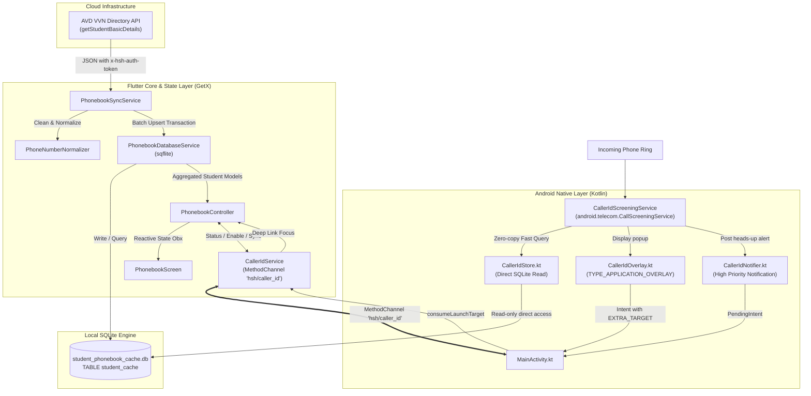

# HSH Student Phonebook & Native Caller ID System Documentation

## 1. System Overview

The **Student Phonebook & Caller ID System** is an enterprise-grade administrative feature designed for Hostel Administrators and Wardens in the HSH ecosystem. It serves two interconnected purposes:

1. **In-App Student Directory (`PhonebookScreen`):**
   - High-speed local search and filtering of all hostel residents by Name, Room number, Student/Enrollment ID, or Phone number.
   - Group-based filtering across hostel wings (`Param`, `Pavitra`, `Pulkit`, `Paramanand`).
   - Multi-number aggregation per student (Student Mobile, Father Contact, Mother Contact, WhatsApp).
   - One-tap actions: Direct Cellular Call, WhatsApp chat launcher, and Clipboard copy.
   - Cross-feature navigation to individual Student Screen Time monitoring.

2. **Native Real-Time Caller ID (Truecaller-style for Wardens):**
   - **Android 10+ (API 29+):** System Call Screening service (`CallerIdScreeningService`) intercepts incoming rings, queries the local SQLite cache in real time, and renders a floating `WindowManager` overlay card with student details and relation tags (e.g., *"Father of Rohan Sharma • Room B-204"*).
   - **System Notification Fallback:** Posts a high-priority heads-up notification with action buttons ("Call back", "Open phonebook").
   - **Tap-to-Inspect Deep Linking:** Tapping the caller ID card opens the app directly focused on that student.
   - **iOS:** CallKit Call Directory Extension provisioning (`CXCallDirectoryExtension`) mapping sorted E.164 phone numbers to formatted labels.

---

## 2. Architectural Blueprint



---

## 3. Directory Structure & File Map

| Component | File Path | Purpose |
| :--- | :--- | :--- |
| **Model** | [phonebook_models.dart](file:///c:/Users/kruta/Desktop/hsh_seva/hsh_app2/lib/features/phonebook/models/phonebook_models.dart) | Data transfer objects (`PhonebookStudent`, `PhonebookContact`, `PhonebookSyncResult`). |
| **Normalizer** | [phone_number_normalizer.dart](file:///c:/Users/kruta/Desktop/hsh_seva/hsh_app2/lib/features/phonebook/services/phone_number_normalizer.dart) | Country code stripping, 10-digit standardisation, E.164 conversion, pretty printing. |
| **Database** | [phonebook_database_service.dart](file:///c:/Users/kruta/Desktop/hsh_seva/hsh_app2/lib/features/phonebook/services/phonebook_database_service.dart) | SQLite database lifecycle, schema migrations (v1->v2), multi-number grouping search queries. |
| **Sync Engine** | [phonebook_sync_service.dart](file:///c:/Users/kruta/Desktop/hsh_seva/hsh_app2/lib/features/phonebook/services/phonebook_sync_service.dart) | Live HTTP sync, parsing family phone contacts, full replacement transactions, timestamp metadata. |
| **Caller ID Bridge**| [caller_id_service.dart](file:///c:/Users/kruta/Desktop/hsh_seva/hsh_app2/lib/features/phonebook/services/caller_id_service.dart) | MethodChannel interface (`hsh/caller_id`) to native role management, overlay permissions, and iOS export. |
| **Controller** | [phonebook_controller.dart](file:///c:/Users/kruta/Desktop/hsh_seva/hsh_app2/lib/features/phonebook/controllers/phonebook_controller.dart) | Reactive GetX controller handling search debouncing, group filter chips, dialer launch, WhatsApp intent, role checks. |
| **UI Screen** | [phonebook_screen.dart](file:///c:/Users/kruta/Desktop/hsh_seva/hsh_app2/lib/features/phonebook/views/phonebook_screen.dart) | Custom Sliver gradient header, search bar, contact details bottom sheet, quick call buttons. |
| **UI Widget** | [caller_id_card.dart](file:///c:/Users/kruta/Desktop/hsh_seva/hsh_app2/lib/features/phonebook/widgets/caller_id_card.dart) | Status banner in the phonebook showing Caller ID enablement and direct action trigger. |
| **Android Service**| [CallerIdScreeningService.kt](file:///c:/Users/kruta/Desktop/hsh_seva/hsh_app2/android/app/src/main/kotlin/com/example/hsh_app2/callerid/CallerIdScreeningService.kt) | Native Android `CallScreeningService` that intercepts calls prior to ring. |
| **Android Store** | [CallerIdStore.kt](file:///c:/Users/kruta/Desktop/hsh_seva/hsh_app2/android/app/src/main/kotlin/com/example/hsh_app2/callerid/CallerIdStore.kt) | Direct SQLite reader accessing `student_phonebook_cache.db` with identical number normalization. |
| **Android Overlay**| [CallerIdOverlay.kt](file:///c:/Users/kruta/Desktop/hsh_seva/hsh_app2/android/app/src/main/kotlin/com/example/hsh_app2/callerid/CallerIdOverlay.kt) | Floating `TYPE_APPLICATION_OVERLAY` view with auto-dismiss on call answer/hangup. |
| **Android Notifier**| [CallerIdNotifier.kt](file:///c:/Users/kruta/Desktop/hsh_seva/hsh_app2/android/app/src/main/kotlin/com/example/hsh_app2/callerid/CallerIdNotifier.kt) | High priority call channel notification with "Call back" and "Open phonebook" intents. |
| **Android Host** | [MainActivity.kt](file:///c:/Users/kruta/Desktop/hsh_seva/hsh_app2/android/app/src/main/kotlin/com/example/hsh_app2/MainActivity.kt) | RoleManager intents, permission handlers, and deep-link intent routing. |

---

## 4. Key Implementation Details

### 4.1 Data Pipeline & Synchronization

1. **API Ingestion:**
   `PhonebookSyncService.syncDirectory()` queries `https://api.avdvvn.org/public/getStudentBasicDetails` using Dio with custom authentication headers (`x-hsh-auth-token`).
2. **Contact Disaggregation:**
   A single student record in the API payload can contain multiple phone records. The parser decomposes each student into up to 4 distinct phone records:
   - **Student Mobile:** Primary contact (`is_primary = 1`).
   - **Father Phone:** With father's middle name if available (e.g. `Father (Rameshbhai)`).
   - **Mother Phone:** Dedicated mother contact.
   - **WhatsApp Number:** If different from personal and parent numbers.
3. **Number Normalization:**
   `PhoneNumberNormalizer.normalize()` strips all non-digit characters and standardises Indian mobile variations:
   - Removes international prefixes `0091`, `+91`, country code `91`, and domestic trunk prefix `0`.
   - Validates that exactly 10 digits remain.
   - Stores normalized 10-digit format in `phone_normalized` for index-backed matching.
4. **Database Storage & Schema:**
   The SQLite cache (`student_phonebook_cache.db`) stores flat records:
   ```sql
   CREATE TABLE student_cache (
     id TEXT PRIMARY KEY,
     student_id TEXT NOT NULL,
     name TEXT NOT NULL,
     enrollment_number TEXT NOT NULL,
     department TEXT NOT NULL,
     batch TEXT NOT NULL,
     email TEXT,
     phone TEXT NOT NULL,
     phone_normalized TEXT NOT NULL,
     is_primary INTEGER DEFAULT 1,
     phone_label TEXT DEFAULT 'Mobile',
     updated_at TEXT
   );
   CREATE INDEX idx_phone ON student_cache (phone);
   CREATE INDEX idx_phone_norm ON student_cache (phone_normalized);
   CREATE INDEX idx_student_name ON student_cache (name);
   CREATE INDEX idx_student_id ON student_cache (student_id);
   ```
5. **Grouping on Query:**
   When searching, `PhonebookDatabaseService.searchStudents()` groups multiple flat phone rows back into a single `PhonebookStudent` model containing a `List<PhonebookContact>`.

### 4.2 Security & Role-Based Access Control

- Phonebook data contains sensitive contact information of students and parents.
- `PhonebookController._checkAdminAccess()` verifies:
  ```dart
  final role = await Get.find<SessionStore>().role;
  if (!role.canOperate) {
    Get.back();
    AppSnackbar.error('Access Denied', 'The Phonebook is restricted to Hostel Administrators and Wardens only.');
    return;
  }
  ```
- Non-admin/warden accounts are kicked out immediately.

### 4.3 Native Android Caller ID Architecture

#### Zero-Copy Local Database Sharing
Instead of syncing SQLite data to native memory or Shared Preferences, `CallerIdStore.kt` opens the SQLite database written by Flutter (`databases/student_phonebook_cache.db`) directly in read-only mode (`SQLiteDatabase.OPEN_READONLY`):
```kotlin
val file = context.getDatabasePath("student_phonebook_cache.db")
db = SQLiteDatabase.openDatabase(file.path, null, SQLiteDatabase.OPEN_READONLY)
db.rawQuery(
    "SELECT student_id, name, department, phone_label, phone_normalized, phone " +
    "FROM student_cache WHERE phone_normalized = ? OR phone LIKE ? " +
    "ORDER BY is_primary DESC LIMIT 5",
    arrayOf(normalized, "%$normalized")
)
```
- **Instant updates:** As soon as Flutter completes a directory sync, the native caller ID lookup is instantly updated with zero IPC overhead.
- **Latency < 5ms:** Essential because Android requires `CallScreeningService` to respond immediately.

#### System Role & Overlay Permissions
1. **Screening Role (`RoleManager.ROLE_CALL_SCREENING`):**
   Android 10+ requires apps to hold this role to receive incoming call events. `MainActivity` launches `RoleManager.createRequestRoleIntent()`.
2. **Floating Overlay (`Settings.ACTION_MANAGE_OVERLAY_PERMISSION`):**
   Allows `CallerIdOverlay` to add a floating `TYPE_APPLICATION_OVERLAY` view directly above the system incall screen.
3. **Call Lifecycle Monitoring:**
   `CallerIdOverlay.watchCallState()` registers a `TelephonyCallback` (API 31+) or `PhoneStateListener` to automatically dismiss the card as soon as the call transitions to `CALL_STATE_OFFHOOK` (answered) or `CALL_STATE_IDLE` (call ended), or after a 60-second safety timeout.

#### Caller Identification Semantics
- If the calling number is registered under a parent: displays `"Father of Rohan Sharma"` or `"Mother of Rohan Sharma"`.
- If siblings share the parent's phone: displays `"Father of Rohan & Meet"`.
- Displays hostel wing/room and student ID.

### 4.4 Tap-to-Inspect Deep Linking

1. Tapping either the native floating card or the notification invokes `CallerIdOverlay.launchIntent()` with extras:
   - `EXTRA_TARGET = "phonebook"`
   - `EXTRA_STUDENT_ID = m.studentId`
   - `EXTRA_QUERY = m.studentId.ifBlank { m.name }`
2. `MainActivity.captureLaunchTarget()` saves this state.
3. Upon launch, Flutter retrieves the intent via `CallerIdService.consumeLaunchTarget()`.
4. `SplashController` or `PhonebookController` receives the query, fills the search field, and filters directly to the caller student.

### 4.5 iOS CallKit Integration Path

iOS does not allow third-party apps to inspect incoming phone numbers at ring time. Instead:
- `CallerIdService.buildDirectoryEntries()` compiles all phone numbers into integer E.164 format (`917984907753`).
- Sorts and deduplicates all entries (CallKit requires strict ascending order).
- Labels are formatted as `"HSH · Rohan Sharma · Room B-204 · Father"`.
- The dataset is exported via App Group storage into a CallKit `CXCallDirectoryExtension`.

---

## 5. MethodChannel Specifications (`hsh/caller_id`)

| Method Name | Direction | Arguments | Return Type | Description |
| :--- | :--- | :--- | :--- | :--- |
| `getStatus` | Flutter -> Native | None | `Map<String, dynamic>` | Returns `{supported, enabled, overlayGranted, active}`. |
| `requestEnable` | Flutter -> Native | None | `bool` | Launches `RoleManager.ROLE_CALL_SCREENING` system request dialog. |
| `requestOverlay`| Flutter -> Native | None | `bool` | Directs user to Settings for `SYSTEM_ALERT_WINDOW` permission. |
| `setActive` | Flutter -> Native | `{"active": bool}` | `void` | Enables or disables native caller ID lookup flag in SharedPreferences. |
| `consumeLaunchTarget` | Flutter -> Native | None | `Map<String, String>?` | Consumes the deep-link query if opened from an overlay/notification. |
| `lookup` | Flutter -> Native | `{"number": String}` | `List<Map>` | Allows testing contact lookup directly without receiving a live call. |
| `exportDirectory` | Flutter -> iOS Native | `{"entries": [[number, label]]}` | `void` | Syncs directory entries to CallKit Call Directory Extension. |

---

## 6. Permissions & Manifest Declarations

In `android/app/src/main/AndroidManifest.xml`:

```xml
<!-- Telecom Screening Service -->
<service
    android:name=".callerid.CallerIdScreeningService"
    android:exported="true"
    android:permission="android.permission.BIND_SCREENING_SERVICE">
    <intent-filter>
        <action android:name="android.telecom.CallScreeningService" />
    </intent-filter>
</service>

<!-- Overlay & Telephony State -->
<uses-permission android:name="android.permission.SYSTEM_ALERT_WINDOW" />
<uses-permission android:name="android.permission.READ_PHONE_STATE" />
<uses-permission android:name="android.permission.READ_PHONE_NUMBERS" />
<uses-permission android:name="android.permission.POST_NOTIFICATIONS" />
```

---

## 7. Verification & Testing Checklist

- [x] **Database Initialization & Migration:** Opens `student_phonebook_cache.db` at version 2, upgrades legacy normalized numbers.
- [x] **Sync Flow:** Connects to AVD VVN directory API, normalizes numbers, atomically upserts records.
- [x] **Search Performance:** Indexed substring matching on name, student ID, room, department, raw phone, and 10-digit normalized phone.
- [x] **Filter Handling:** Tested group isolation for `Param`, `Pavitra`, `Pulkit`, and `Paramanand`.
- [x] **Native Android Lookup:** Validated zero-copy SQLite query from `CallerIdStore.kt`.
- [x] **Deep Linking:** Confirmed `MainActivity` intent extraction and navigation to `PhonebookScreen`.
