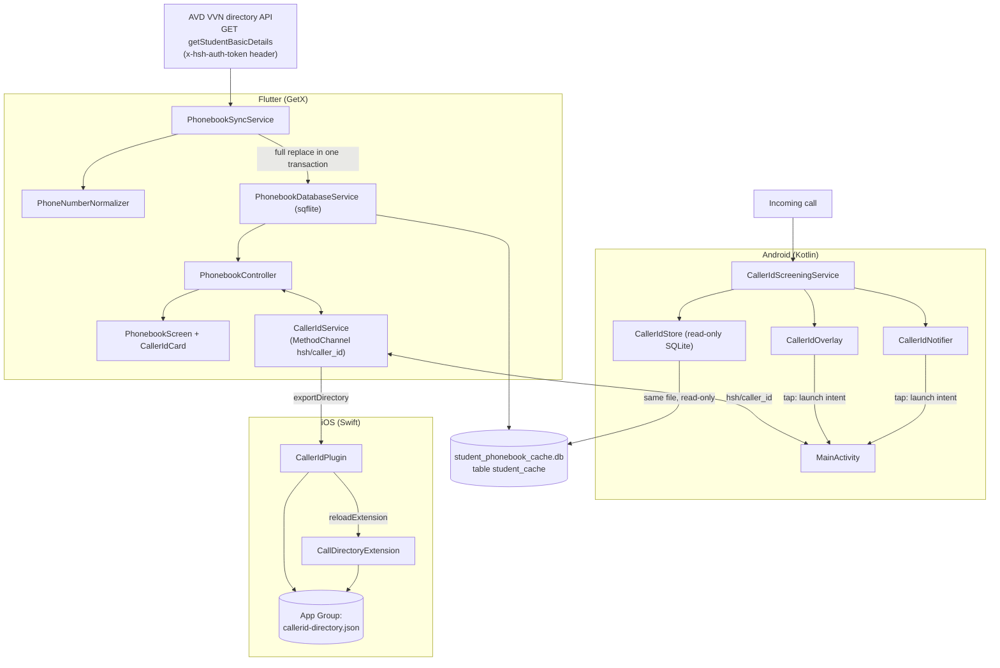

# Student Phonebook & Caller ID

> **Last updated:** 2026-10-06 · **Repo:** `hsh_app2` (Flutter, native Android, native iOS). The phonebook does not use `hsh_api`; it reads the AVD VVN directory API directly.
>
> iOS signing and Xcode setup for caller ID: [ios/CALLER_ID_SETUP.md](../ios/CALLER_ID_SETUP.md) (quick reference) and [ios/CALLER_ID_HANDOFF.md](../ios/CALLER_ID_HANDOFF.md) (full guide).

---

## 1. What this feature does

| Part | Summary |
| :--- | :--- |
| **Student Phonebook** | Offline, searchable directory of every hostel resident with the student's and parents' numbers. Filter by group (Param, Pavitra, Pulkit, Paramanand); call, WhatsApp or copy any number; jump to the student's screen time. |
| **Caller ID (Android 10+)** | When a student or parent calls the warden's phone, a card pops up over the incoming-call screen ("Father of Rohan Sharma · Param • Room 204") and a notification is posted. |
| **Caller ID (iOS)** | iOS never shows apps the caller's number, so the whole directory is exported to a CallKit Call Directory extension; iOS prints the label on the call screen and in Recents. |

**Who can use it:** sessions whose role passes `UserRole.canOperate` (admin or warden). The operator console signs in with the admin role. Caller ID is switched off automatically for any other role and on logout.

---

## 2. Architecture



---

## 3. File map

| Component | File | Role |
| :--- | :--- | :--- |
| Models | [phonebook_models.dart](../lib/features/phonebook/models/phonebook_models.dart) | `PhonebookStudent`, `PhonebookContact`, `PhonebookSyncResult`. Derives room and group from `department`. |
| Normalizer | [phone_number_normalizer.dart](../lib/features/phonebook/services/phone_number_normalizer.dart) | 10-digit Indian numbers, E.164 integers for CallKit, display formatting. |
| Database | [phonebook_database_service.dart](../lib/features/phonebook/services/phonebook_database_service.dart) | SQLite schema v2, v1→v2 migration, bulk sync, grouped search, caller-ID rows. |
| Sync | [phonebook_sync_service.dart](../lib/features/phonebook/services/phonebook_sync_service.dart) | Downloads the directory and maps each student into up to four phone rows. |
| Caller ID bridge | [caller_id_service.dart](../lib/features/phonebook/services/caller_id_service.dart) | `hsh/caller_id` calls; builds the iOS directory entries. |
| Controller | [phonebook_controller.dart](../lib/features/phonebook/controllers/phonebook_controller.dart) | Access check, search debounce, group filter, sync, caller ID on/off, dialer/WhatsApp/clipboard. |
| Screen | [phonebook_screen.dart](../lib/features/phonebook/views/phonebook_screen.dart) | Header with sync, caller-ID card, search, group chips, student cards, detail sheet. Route `Routes.operatorDirectory`. |
| Caller ID card | [caller_id_card.dart](../lib/features/phonebook/widgets/caller_id_card.dart) | Status and enable/turn-off button, with platform-specific copy. |
| Session hooks | [session_store.dart](../lib/core/storage/session_store.dart) | Turns caller ID off for non-admin/warden sessions and on logout. |
| Launch handling | [splash_controller.dart](../lib/features/splash/controllers/splash_controller.dart) | Opens the phonebook on the calling student when the app was launched from the card or notification. |
| Android | [CallerIdScreeningService.kt](../android/app/src/main/kotlin/com/example/hsh_app2/callerid/CallerIdScreeningService.kt) | `CallScreeningService`: identifies (never blocks) incoming calls. |
| Android | [CallerIdStore.kt](../android/app/src/main/kotlin/com/example/hsh_app2/callerid/CallerIdStore.kt) | Reads the phonebook SQLite file read-only; the `active` switch; number normalization (same rules as Dart). |
| Android | [CallerIdOverlay.kt](../android/app/src/main/kotlin/com/example/hsh_app2/callerid/CallerIdOverlay.kt) | The popup card, its dismissal, and the launch intent. |
| Android | [CallerIdNotifier.kt](../android/app/src/main/kotlin/com/example/hsh_app2/callerid/CallerIdNotifier.kt) | High-priority notification with "Call back" and "Open phonebook". |
| Android | [MainActivity.kt](../android/app/src/main/kotlin/com/example/hsh_app2/MainActivity.kt) | `hsh/caller_id` handler, Call Screening role request, launch-target capture. |
| iOS | [CallerIdPlugin.swift](../ios/Runner/CallerIdPlugin.swift) | `hsh/caller_id` handler: status, Settings, export, clear. |
| iOS | [CallDirectoryHandler.swift](../ios/CallDirectoryExtension/CallDirectoryHandler.swift) | Feeds the exported entries to iOS. |

`lib/features/operator/views/operator_directory_screen.dart` (`OperatorDirectoryScreen`) is not registered as a route and is unused; the "Student Phonebook" tile opens `PhonebookScreen`.

---

## 4. Data pipeline

### 4.1 Source and sync

- **Source:** `GET https://api.avdvvn.org/public/getStudentBasicDetails` with header `x-hsh-auth-token`. The token is a constant in `PhonebookSyncService.liveAuthToken` (also in `AppConfig`).
- **When it runs:** when a warden taps **Sync Directory**, and silently when the phonebook is opened with an empty cache. There is no background or periodic sync.
- **How:** the whole cache is replaced in one SQLite transaction (`fullReplace: true`). The last sync time and student count are kept in secure storage and shown in the header.
- After every successful sync the iOS caller-ID directory is rebuilt (no-op on Android, which reads the cache live).

### 4.2 How one API record becomes cache rows

| Cache field | Built from |
| :--- | :--- |
| `name` | `firstName middleName lastName` |
| `student_id` | `HSH-<bankCode>`; fallback `HSH-<last 4 of aadhar>`, then `HSH-<index>` |
| `enrollment_number` | `bankCode`; fallback `Room <room>`, last 6 of aadhar, then `AVD-<index>` |
| `department` | `<Group> • Room <room>`. Group is normalised to Param / Pavitra / Pulkit / Paramanand (`parmanand` is accepted); otherwise `Room <room>` or `HSH Resident`. |
| `batch` | `status`, uppercased |

Each student produces **up to four rows**, one per distinct number:

| `phone_label` | API field | `is_primary` | Skipped when |
| :--- | :--- | :--- | :--- |
| `Student Mobile` | `phone` | 1 | empty |
| `Father (<middleName>)` or `Father Contact` | `fatherPhone` | 0 | empty or same as the student's |
| `Mother Contact` | `motherPhone` | 0 | empty or same as an earlier number |
| `WhatsApp` | `whatsAppNumber` | 0 | empty or same as an earlier number |

### 4.3 Number normalization (identical in Dart and Kotlin)

Strip non-digits; then, only while more than 10 digits remain, drop a leading `00`, then `91`, then `0`. Exactly 10 digits must be left, otherwise the number is not normalizable. Examples: `+91-79849-07753`, `079849 07753` and `917984907753` all become `7984907753`.

The cache stores the raw number in `phone` and the 10-digit form in `phone_normalized` (the raw value if it can't be normalized).

### 4.4 SQLite schema (`student_phonebook_cache.db`, version 2)

```sql
CREATE TABLE student_cache (
  id TEXT PRIMARY KEY,              -- '<student_id>_<phone>_<label>'
  student_id TEXT NOT NULL,         -- 'HSH-<bankCode>'
  name TEXT NOT NULL,
  enrollment_number TEXT NOT NULL,
  department TEXT NOT NULL,         -- 'Param • Room 204'
  batch TEXT NOT NULL,
  email TEXT,
  phone TEXT NOT NULL,              -- as received
  phone_normalized TEXT NOT NULL,   -- 10 digits
  is_primary INTEGER DEFAULT 1,
  phone_label TEXT DEFAULT 'Mobile',
  updated_at TEXT
);
CREATE INDEX idx_phone ON student_cache (phone);
CREATE INDEX idx_phone_norm ON student_cache (phone_normalized);
CREATE INDEX idx_student_name ON student_cache (name);
CREATE INDEX idx_student_id ON student_cache (student_id);
```

**v1 → v2 migration:** v1 stored the raw string in `phone_normalized`, so caller-ID lookups never matched. The upgrade re-normalizes every row.

### 4.5 Search

- Typing is debounced by 300 ms.
- If the query contains **3 or more digits**, it matches `phone`, `phone_normalized` (digits only), `name`, `student_id`, `enrollment_number` and `department`; otherwise only the text fields.
- Room search works through `department` ("Room 204").
- Group chips filter on `department`; **Param** excludes Paramanand.
- Up to 500 rows (ordered by name) are grouped back into one `PhonebookStudent` per `student_id`.

---

## 5. Phonebook UI

Operator home → **Student Phonebook** (`Routes.operatorDirectory`).

- **Access check:** if the role isn't admin or warden, the screen closes with "Access Denied".
- **Header:** title, back, **Sync Directory** button, "N Students Cached" and last-sync chips.
- **Caller ID card:** see sections 6.1 and 7.
- **Search bar** and **group chips** (All, Param, Pavitra, Pulkit, Paramanand).
- **Student cards:** name, group, room, primary number, quick **Call** and **WhatsApp** buttons.
- **Detail sheet** (tap a card): every number with copy, WhatsApp and call; email with copy; **View Individual Screen Time**, which opens `Routes.studentScreenTime` with `{name, room}` only. Phonebook records have no `students.id` (they come from the directory API), and Screen Time identifies students by that id alone, so it opens its directory searched by the student's name and the warden taps the right student. The bank code is never sent; the API would read `0768` as student #768.
- Call uses `tel:`; WhatsApp opens `https://wa.me/91XXXXXXXXXX` in the external app.

---

## 6. Caller ID on Android (10+)

### 6.1 Turning it on

1. The warden taps **Enable** on the caller-ID card.
2. `requestEnable` shows the system sheet "Set HSH App as your caller ID & spam app?" (`RoleManager.ROLE_CALL_SCREENING`). If the role is granted, the native `active` flag is set to true.
3. If "Display over other apps" isn't granted yet, the app opens that Settings page (`requestOverlay`). Without it there is no popup, only the notification.

Card states: **Know who's calling** + Enable (not set up or turned off), **Caller ID is on** + Turn off (with a hint if the overlay is blocked), **Caller ID not available** (Android 9 or older).

### 6.2 The `active` switch

Stored in SharedPreferences (`hsh_caller_id` → `active`) so the screening service can check it without Flutter running.

| Set to | When |
| :--- | :--- |
| `true` | The role is granted through `requestEnable` (or was already held) |
| `false` | **Turn off** on the card; logout; any login whose role isn't admin or warden |

### 6.3 What happens when a call arrives

1. `CallerIdScreeningService.onScreenCall()` **always allows the call** (identification only; nothing is ever blocked).
2. It stops if `active` is false or the call isn't incoming.
3. `CallerIdStore.lookup()` normalizes the number and opens the phonebook SQLite file **read-only** (the same file Flutter writes, so it's as fresh as the last sync):

   ```sql
   SELECT student_id, name, department, phone_label, phone_normalized, phone
   FROM student_cache
   WHERE phone_normalized = ? OR phone LIKE '%<10 digits>'
   ORDER BY is_primary DESC LIMIT 5
   ```

   Results are de-duplicated by student and relation.
4. With at least one match it posts the **notification** and, if the overlay permission is granted, shows the **popup card**.

### 6.4 What the warden sees

- **Relation** from `phone_label`: contains "father" → Father, "mother" → Mother, "whatsapp" → WhatsApp, "guardian"/"parent" → Guardian, anything else → Student.
- **Headline:** `Rohan Sharma` for the student; `Father of Rohan Sharma` for a parent; `Father of Rohan & Meet` when siblings share the number (first names).
- **Card second line:** department, `ID HSH-0768`, `+91 79849 07753`. Top label: `HSH Phonebook · Father`.
- **Notification:** same headline; body `<department> · <number>`; actions **Call back** (opens the dialer) and **Open phonebook**; channel "Caller ID" (high importance).

### 6.5 Card lifecycle

The card sits near the top of the screen above the call UI. It closes when the call is answered or ends (only if `READ_PHONE_STATE` was granted; it is requested on the login screen), when the warden taps ✕ or the card, or after 60 seconds.

### 6.6 Tap to open the student

Tapping the card or the notification launches the app with extras `hsh_target = "phonebook"`, `hsh_student_id` and `hsh_query` (the student ID, or the name if there's no ID). `MainActivity` stores them; on startup the splash controller reads them once through `consumeLaunchTarget` and, for admin or warden sessions, opens the phonebook with the search pre-filled. This works on a **cold start only** (see section 10).

---

## 7. Caller ID on iOS

1. **Enable** opens Settings → Phone → Call Blocking & Identification (directly on iOS 13.4+), where the user switches on HSH. iOS has no in-app prompt.
2. `CallerIdService.syncDirectory()` builds the directory from the cache after each sync, when enabling, and every time the phonebook opens while enabled:
   - one entry per number, as an E.164 integer (`917984907753`);
   - names are shortened to first + last name; siblings sharing a number are merged (`Rohan Sharma & Meet Sharma`, or `Rohan Sharma +2` for three or more);
   - label `<who> · <place> · <relation>`, e.g. `Rohan Sharma · Rm 204 (Param) · Father`. The relation is left out for the student's own number and the place when it isn't known. Labels longer than 60 characters are cut with "…";
   - sorted ascending with no duplicates (CallKit rejects the whole batch otherwise).
3. `CallerIdPlugin` re-sorts and de-duplicates defensively, writes `callerid-directory.json` to the App Group `group.in.innovatiq.hshApp2`, and asks CallKit to reload `in.innovatiq.hshApp2.CallDirectoryExtension`.
4. `CallDirectoryHandler` reads the file and adds every entry (on incremental reloads it clears and resends everything).
5. `setActive(false)` (Turn off, logout, non-admin login) deletes the file and reloads, so labels disappear.

There is no tap-to-open on iOS (`consumeLaunchTarget` returns nil).

---

## 8. MethodChannel `hsh/caller_id`

| Method | Arguments | Android | iOS |
| :--- | :--- | :--- | :--- |
| `getStatus` | — | `{supported (API 29+), enabled (role held), overlayGranted, active}` | `{supported: true, enabled, overlayGranted: true, active, iosState: enabled/disabled/unknown}` |
| `requestEnable` | — | Role request sheet → `bool` | Opens Settings → `bool` |
| `requestOverlay` | — | Opens "Display over other apps" → `bool` (already granted) | `false` |
| `setActive` | `{active: bool}` | Saves the flag; hides the card when false | Saves the flag; false also clears the directory |
| `consumeLaunchTarget` | — | `{target, studentId, query}` once, else null | `nil` |
| `lookup` | `{number}` | Test lookup without a real call → list of matches | not implemented |
| `exportDirectory` | `{entries: [[number, label], ...]}` | not implemented | Writes the directory and reloads the extension |

---

## 9. Permissions and configuration

**Android** (`android/app/src/main/AndroidManifest.xml`): `READ_PHONE_STATE`, `READ_PHONE_NUMBERS`, `SYSTEM_ALERT_WINDOW`, `POST_NOTIFICATIONS`, plus:

```xml
<service
    android:name=".callerid.CallerIdScreeningService"
    android:exported="true"
    android:permission="android.permission.BIND_SCREENING_SERVICE">
    <intent-filter>
        <action android:name="android.telecom.CallScreeningService" />
    </intent-filter>
</service>
```

**iOS:** App Group `group.in.innovatiq.hshApp2` on both the Runner and CallDirectoryExtension targets; extension bundle ID `in.innovatiq.hshApp2.CallDirectoryExtension`; a paid Apple Developer team is required. Details in [ios/CALLER_ID_HANDOFF.md](../ios/CALLER_ID_HANDOFF.md).

---

## 10. Known issues and limitations

- **"View Individual Screen Time" needs one extra tap:** it opens the Screen Time directory searched by name rather than the student directly, because the phonebook has no `students.id`. (This replaced passing the bank code, which opened the wrong student: 1,186 of 1,204 local bank codes equal another student's id.)
- **Tap-to-open works on cold start only.** If the app is already running, tapping the card or notification brings it to the front but doesn't open the student; only the splash screen consumes the launch target.
- **iOS card copy:** "Caller ID is on" says labels look like `HSH · Name · Room · Relation`, but labels have no `HSH ·` prefix (actual format in section 7).
- **Notification permission:** `POST_NOTIFICATIONS` is never requested at runtime, so on Android 13+ the caller-ID notification may not appear; the popup card still works.
- **Directory API token is shipped in the app** (`PhonebookSyncService`, `AppConfig`). Anyone with the APK can read it. Proxying the directory through `hsh_api` would keep it server-side.
- **No automatic refresh:** the cache only updates on a manual sync (or when it's empty).
- **Different identifiers:** phonebook IDs (`HSH-<bankCode>`) are not `hsh_api`'s `students.id`.
- **Android 9 and older** cannot use caller ID.

---

## 11. Manual test checklist

- [ ] An admin/warden opens the phonebook; a student or leader account is turned away.
- [ ] **Sync Directory** completes and the cached count and last-sync time update.
- [ ] Search by name, room, `HSH-` ID and by 3+ digits of a parent's number; group chips filter correctly (Param excludes Paramanand).
- [ ] Android: Enable → role sheet → overlay permission; the card shows "Caller ID is on".
- [ ] A call from a stored parent number shows the popup and the notification with the right relation; the popup closes on answer or hang-up.
- [ ] Tapping the popup on a cold start opens the phonebook filtered to that student.
- [ ] **Turn off**, logout, or logging in as a non-admin stops all caller-ID popups.
- [ ] iOS: enable in Settings, sync, then an incoming call from a stored number shows the label.
